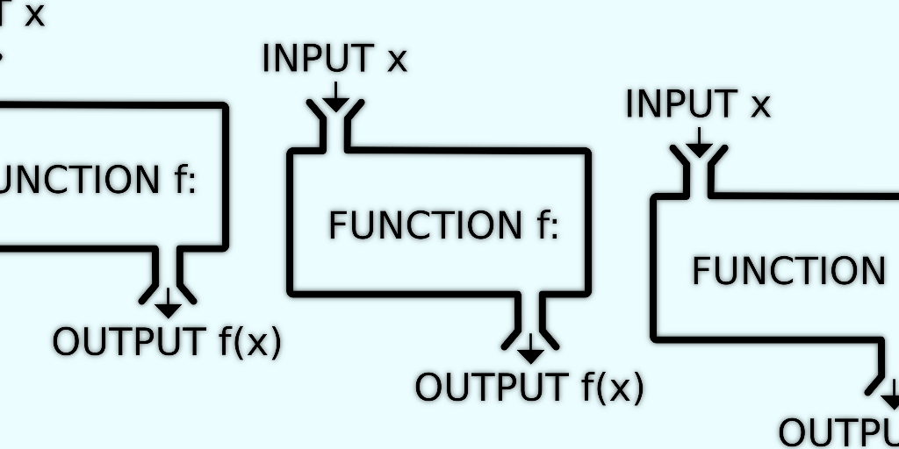

+++
title = "From cobalt.rs to gutenberg"
date = 2018-03-28
tags = ["gutenberg", "cobalt", "cobalt.rs", "rust", "static site", "generator", "migration", "conversion", "switch"]
category = "default"
[extra]
has_image = true
has_hero = true
image_alt = "Why I moved to gutenberg, a static site generator written in Rust"
+++

I wish I could have the features of both tools, but for now I will use gutenberg over cobalt. A tiny migration and feature comparison story.

<!-- more -->

While [cobalt][cobalt] is a pretty nice and easy static site generator written in Rust (in the vein of [Jekyll][jekyll], the famous tool used for GitHub pages), I struggled a bit.
Especially that the stylesheet compilation is not enabled by default yet, but also other tiny annoyances or missing features played into that. I still want to stick with [Rust][rust] and the only other active option here is [gutenberg][gutenberg]. But to be honest, this one also comes with its complications.

**Cobalt** is your tool for a quick blog-like setup, because it supports the usual two different article types of (static) pages and blog posts. **Gutenberg** doesn't really have such distinction, and therefore you need to be more elaborate if you want to achieve the same.

### Not all perfect, but we're getting there

Since both projects are pretty young, they share similar shortcomings: the template libraries are usually not feature complete yet or behave a slightly bit different than their spiritual role models. Mostly one can work around those issues, but it's a bit painful still.

Gutenberg shines here a bit brighter, since it supports macros and shortcodes. Especially the latter is something nice, because I can quickly enrich my pages with snippets, which are usually weird or hard to be done purely in Markdown. Embedded HTML is not the nicest thing and if I can abstract them away, I'm all in for that.

Another tiny plus: Gutenberg is supported by [Netlify][netlify], therefore I do not need to install the binary somehow on their side. Now I can let it build the final site on deployment and skip committing a prebuilt project. Pretty sure I could have done it with cobalt as well, but this way it worked out of the box.

### Tools, tools, tools

Speaking of tooling: I was a bit adventurous and bundled two tiny binaries anyway and it worked.

#### `fd` - the simpler find, written in Rust

[fd][fd] advertises itself as _A simple, fast and user-friendly alternative to 'find'._

And according to their benchmarks it is incredibly fast. But I also like the easier command-line options. The interface is designed for the common cases. And it is written in Rust. Have I mentioned that I love Rust? No? ;-)

#### `tidy-html5` - getting rid of awkward whitespaces and indentation

> The granddaddy of HTML tools.

_The granddaddy of HTML tools._ — well, yes, [tidy][tidy] is a pretty old tool, I probably used it already 10+ years ago.

I recommend this helper to anyone who gets slightly shitty HTML generated from their CMS, static site generator or whatevery is producing such files automatically.

Usually there is no harm in leaving the HTML pages as they are, as long as they render in most browsers. I like my pages nice and clean. And I wish most programs would come with tidy builtin. I know, I know, I'm such a dreamer.

Here a snippet how I use `fd` and `tidy` for my post processing:

```mk
# from my Makefile:

TIDY_SETTINGS = -q -m -w 0 -i \
                --indent-with-tabs yes \
                --indent-spaces 2 \
                --tab-size 2 \
                --clean yes \
                --join-styles yes

build-tidy-html:
  fd -p public -e html -x sh -c "echo {} && tidy $(TIDY_SETTINGS) {}" \;
```

* find all files with extension `.html` in the `public` folder
* apply command with `-x` option; \
  since I want to do multiple things I have to wrap it with `sh -c "…"`
* `tidy` removes all superfluous whitespaces and empty lines, properly indents the tags, and cleans up the inline styles, which is quite handy for the code snippes, because gutenberg (and cobalt) do not use a global/external stylesheet for the syntax highlighting

If you want to learn more about all the possible flags and options, check out the [tidy reference][tidyref] for details and explanations.

This step helps me a lot getting a consistent output for my whole site, also I will get warnings/errors in case I messed up something in my templates and markup.


### More about `gutenberg`

In the [gutenberg repo][sitegen-comp] itself is a nice comparison between **gutenberg**, **cobalt**, **hugo**, and **pelican**. Since I'm not really interested in non-Rust generators I just keep rephrasing the differences between the first two.

The only thing gutenberg has not is the [data files][cobalt-data] feature of cobalt, which can be seen as flat file databases in YAML, JSON, or TOML format. You would maybe need this if you organize and use a lot of data while site generation step. While it sounds nice it is not something I really need yet.

What I really appreciate in gutenberg is the wide support of tiny features complementing Markdown based editing. Similar to GitHub wikis you can internally link between documents. Furthermore you get automatically linkable headers and can autogenerate a table of contents (TOC). The template engine is pretty nice (I still need more definable types like [arrays][array-issue] and maps, something I could do with liquid based engines). Themes, Aliases, and Pagination are not my main concern yet, but at least the latter could come in handy pretty soon. What I really like are the (custom) shortcodes, I loved it already years ago as a WordPress plugin (or you remember them even from bulletin board/forum software). And the macro system is quite useful when you do base your design on a theme. As mentioned above the stylesheet compilation based on SASS is quite nice, just because splitting up the styles in logical chunks helps to better reason about them.

Currently there is [a discussion about custom taxonomies][taxodisco] which is interesting.

Oh and I totally forgot a tiny but really convenient feature: the automatic page reloading while editing and tweaking. People who also build React apps will love it.

#### Wishlist

I have more items I'd like to see:

* probably a plugin system, although I have not an idea yet, how it could look like; but since gutenberg itself seems to be a pretty modular codebase there might be an option to get this going (extension language does not have to be Rust though)
* more "native" blog support (a collection type of blog post based on a common parent directory)
* better page collection access, globally (I have seen that this is done internally already for sitemap and feed generation, we just need to abstract and expose this nicely)
* tera, the template engine could probably benefit from more types and related filters/builtin functions; even with the macro system some things still feel clumsy or nearly impossible

### Migrate all the things

Although gutenberg is not cobalt or Jekyll, the move was not as painful as I initially thought it would be.
The template languages are similar enough, syntactically and semantically, so that adjustments were sometimes just search-and-replace, both use curlies for their tags.

Some of the shortcomings of [Tera][tera] made some changes slightly more difficult, but overall nothing was totally impossible, or I could just live with a similar but simpler solution for now.

I didn't like the builtin rss feed generation and it lacks different feed formats anyway, so I work around this by creation my own feed pages in a slightly awkward way: I built "html" pages for each feed format and rename/move the files in a post processing step later. The sitemap generation was a bit more straight forward.

The biggest part of my time I spent in adopting the blog post directory structure and page traversal for the home page. And while writing this post I have an idea how to make my life easier in the future: since I'm not really using the categories (yet) I could utilize a default category page for simpler blog post listings. Will definitely try this one. (If/when we get custom taxonomies I could shift again to use categories as intended.)

The organization of post related assets is now a bit different, but maybe even easier/more intuitive. Getting the cover image URL became a bit simpler now.

Overall the migration was quite fast, less than a day or so. For how it was done I recommend to head over to the [markentier.tech repository][mtt-repo] and check out the commit history.



### Functions, lambdas, and "serverless"

Recently Netlify [opened up their previous beta features][netlify-blogpost]: **Forms, Identity, and Functions (Lambdas).**

I have no immediate use for the forms and identity service (yet), but the functions are probably a nice feature to check out first.

As with most of their tools and support they promise that it will be easy or easier than the underlying solution. And while I haven't even actively played around with AWS Lambda yet, I tested it via Netlify's Functions feature. The free tier is quite limited, of course, but I cannot image a simpler way to get started with functions and lambdas and the whole serverless universe. Although I don't really like this marketing term, since in the end everything is running on some server somewhere. I'd rather think of the evolution after [Heroku][heroku], which never claimed to be serverless, but a platform where most of the painful infrastructure administration is abstracted away. Functions and Lambdas just further narrow down the scope and surface, but still: they are really tiny applications running on managed servers and services, and a little bit more on demand.

And I have to admit, there is great appeal in such services. Especially for single person projects (like this site), where you want a little bit more than just pure static, but also do not want to invest too much time and effort in setting things up.

Because in the end all you really want is: **getting things done.**

[array-issue]: https://github.com/Keats/gutenberg/issues/270
[cobalt-data]: http://cobalt-org.github.io/docs/data.html
[cobalt]: https://cobalt-org.github.io/
[fd]: https://github.com/sharkdp/fd
[gutenberg]: https://www.getgutenberg.io/
[heroku]: https://www.heroku.com/
[jekyll]: https://jekyllrb.com/
[mtt-repo]: https://github.com/markentier/markentier.tech
[netlify-blogpost]: https://www.netlify.com/blog/2018/03/20/netlifys-aws-lambda-functions-bring-the-backend-to-your-frontend-workflow/
[netlify]: https://www.netlify.com/
[rust]: https://www.rust-lang.org/
[sitegen-comp]: https://github.com/Keats/gutenberg#comparisons-with-other-static-site-generators
[taxodisco]: https://github.com/Keats/gutenberg/issues/246
[tera]: https://tera.netlify.com/
[tidy]: http://www.html-tidy.org/
[tidyref]: http://api.html-tidy.org/tidy/quickref_5.6.0.html
