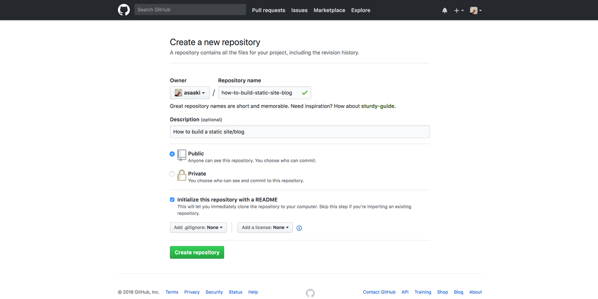
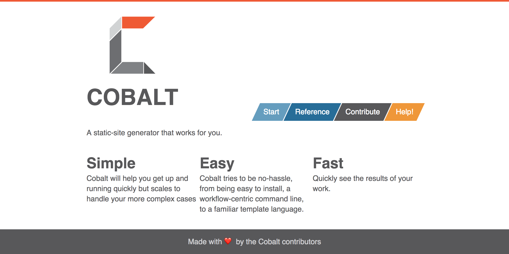
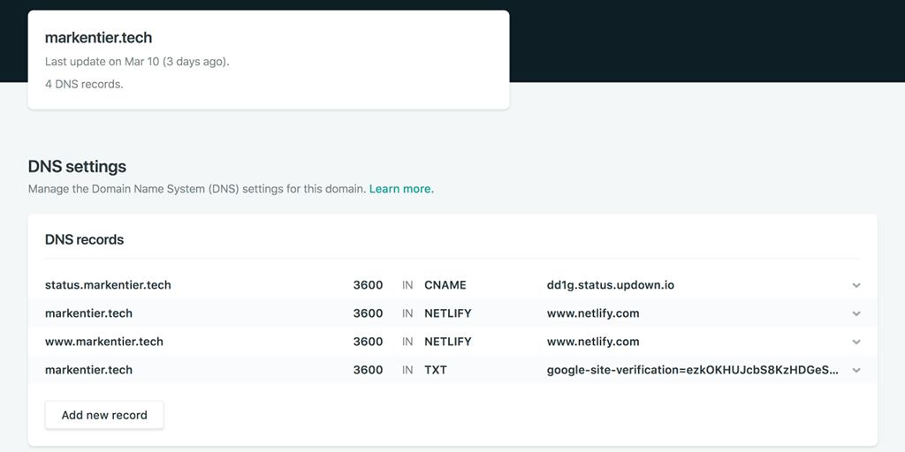
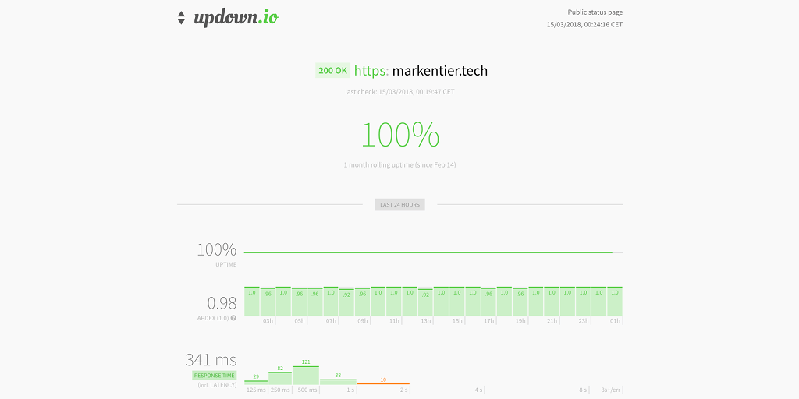

+++
title = "How to build a static site/blog"
date = 2018-03-15T00:23:42Z

[taxonomies]
tags = ["SSG", "static site", "generator", "netlify", "cobalt.rs", "tls", "ssl", "github", "lets encrypt", "blog"]
categories = ["default"]

[extra]
has_hero = true
image_alt = "About how to build a static site or blog"
+++
A comment on my previous post [»Push, rinse, repeat …«](/posts/2018/03/push-rinse-repeat/) made me think about that you might want to know how this blog is being built and deployed.

<!-- more -->

This site (if you reading this blog post at its canonical location) is freshly hatched. And I realized that I used a couple of things some people might not be familiar with … yet.

While everything is still in progress, the heavy lifting for getting it up and running is already done, and I think I can maybe give you some insights on how it is made.

In this article we will discover how to get a static site or blog bootstrapped with a GitHub repository, filling it with cobalt.rs, deploying on netlify, using your own domain, get it DNS managed, and using SSL/TLS via Let's Encrypt (https!). A final note on status monitoring via updown.io included as well.

Sounds exciting? Then keep reading. Beware the long read, it is probably not your typical how-to guide, it is more like a journey.

### Darkness was over the surface of the deep

Step Zero would be to have a reason why you want to build a site or blog, but I assume you found your reason already and just cannot wait to get your ideas published into the world.

So especially tech-savvy people love to build or run their own stuff. The middle of a hosted blog and running stuff on your own server is probably using some managed services without relying on the software of the hosting providers. Tools like WordPress are cool and I remember that they are quite beginner friendly, also to the lesser tech-savvy ones, but—no matter your actual background and knowledge—you might have come to the conclusion that you really want to explore the field of owning more of the build and run aspect. You might not need a fully fledged software, maybe even require less to no dynamic features (makes it mostly safer against hacks), or you're just not satisfied with what they offer. But writing your own CMS or blog engine from scratch is also something many developers have tried, but in the end stepped away or replaced this idea with better projects. I always wanted to build such software, but lost interest or motivation in continuing it. A static site usually serves my purposes quite well.

### All your rebase are belong to us

Anyway I'm lost in my own thoughts, but you want to read a guide, not my history and reasoning. At least I could save this for a future post.

So, the very first thing is: **how and where do I want to store my data (content and site stuff) and which tool do I want to use to build and manage?**

Nowadays a GitHub repository seems to be the most favourite choice. You could use alternative services and even another version control system entirely. Git is quite popular and you will find a lot of help out there when stuck.

Since we want to build a static site, we need a tool helping us. Of course, you could write and maintain everything manually, but you will get exhausted by it.

### Generators, Generators, Generators!

So naturally a vast amount of static site generators exists, because a lot of people feel the same. And plenty of them created applications to help us.

I went for [cobalt](https://cobalt-org.github.io/), because I want to learn and use Rust more often. If you not so much into such adventures, then the following tools will do it as well: _Jekyll, Hugo, OctoPress, Gatsby, Middleman, …_ (check out <https://www.staticgen.com/> to get a more complete list of available static site generators). Jekyll is special, because it is also supported by [GitHub Pages](https://pages.github.com/), which would be another alternative to deploy your static site.

Within your freshly cloned and probably still very empty repository you run something like `cobalt init` (or whatever your tool requires) and start the heavy work of creating a website from bits and pieces. You can spend already hours and days just building the site, since layout and design are a neverending story.
But also pages and posts need to be written, and this will take some time as well.

### `</head><body>`

Of course, you can start easy. It doesn't have to be pixel perfect right from the start. Look at this one, it might seem a bit rough and edgy here and there (depending when you will discover this article).

Anyway, let's assume you learned some lessons around web design and writing. So don't forget to commit and push your changes to your GitHub repository. Do it more often than not. Your computer might store everything now, but it's not reliable in the long run and you don't want to deploy your machine anyway. Building a home server is a completely different story.

So, you built, wrote, pushed. Now we come to the beauty of 2018: let it automatically publish your site and expose it to the world!

### Publish it like it's hot

I discovered [netlify](https://www.netlify.com/) just because we use and support it at my work ([Contentful](https://www.contentful.com/)), and by googling for this article I just found some resources if you're interested in it:

* <https://www.gatsbyjs.org/blog/2017-12-06-gatsby-plus-contentful-plus-netlify/>
* <https://dev.to/milkstarz/contentful-and-netlify-the-dynamic-duo-of-static-site-management-55i>
* <https://www.smcculloch.com/code/netlify-contentful-jamstack>
* <https://www.netlify.com/blog/2017/07/06/contentful-an-api-first-cms/>

Since I'm not starting with a Contentful-backed approach I will not dive deeper into it. I leave the advertising to our evangelists for now. :-)

Initially I really thought that GitHub Pages would be okay already, but netlify comes with some batteries I didn't want to miss, the biggest one was the [Let's Encrypt](https://letsencrypt.org/) based SSL/TLS certificate, so I can get `https` all the time and not have to think about the renewal in the future. This works best if you not only bring your own domain, but also can configure it this way that you can let netlify manage your DNS settings (I think this was recommended for better subdomain stuff and enforcing https across them; could be done in your DNS provider probably, but hey, let's give it a try and see how netlify can deal with it).

Another cool feature is that you can use GitHub's pull requests (and branching in general) to get a preview deployment. So you can check your changes not only on your local machine, but also let other see how the things will look like (pretty good for teams and collaboration). In fact, I used this for this blog post, so I can test this opportunity. Another tiny benefit is that you can use online validators (like <https://validator.w3.org/nu/> for HTML) and fix issues before they go into your production site. Sounds cool, he?

_Hey, netlify folks, when you reading this by accident, you can donate a bit to [my PayPal account](https://www.paypal.me/asaaki) for my advertisement efforts._

Setting up netlify is quite easy even without the domain stuff. Point it to your repository and maybe define what (supported) tool should be run.
Since `cobalt` is not widely used yet, I already ship my generated site with the repo, so I only need to tell netlify, which folder to use instead. That would be also the case if you went full manual and craft your pages by hand.

Netlify offers a lot more stuff, which I'm not using yet. You should discover their features on your own. Split testing might be interesting for sites with customers and your attempts to drag them to CTAs (call to actions). Form handling is probably nice if you want to get feedback or collect other data.

### Hey, author, where you're going?

Sorry. You wanted to know how difficult it is to get your site deployed with netlify.

Well, I have to disappoint you. Once you've set up your repo, branch and optional configs, you're pretty much done.
You can either trigger a deployment manually or just push changes to your previously configured branch.
You wait a few seconds (the very first deployment might take a slightly bit longer) and then you check if you're site is up and running.

I really mean it, it is so simple, that any How To for netlify is more complicated and longer than their step by step guidance within their interface. Give it a try.

If you're really stuck, then their help pages should do the rest.
All the things I wanted to use and try was provided within netlify's documentation. And in the end, deploying a static site should not be so much magic.

### Vertrauen ist gut, Kontrolle ist besser

I know that nothing comes with perfect 100 percent uptime. That's usually okay. And better you're notified about it. Independently, of course.
While you can go with well-known services like pingdom, I use [updown.io](https://updown.io/), which is not free, but with initial signup you will get enough credits to monitor a single website for a long time. If you think it is really not worth it, change to another uptime monitoring solution.

What I like about updown is, that they offer a simple status page, you can expose via a subdomain you control. For this blog you can check it under <https://status.markentier.tech/>:

That's all I have for today.

I hope this article is useful to anyone of you. If you want to give feedback, have questions or suggestions, you can usually find me on Twitter: <https://twitter.com/asaaki> — See you soon! 👋🏽
