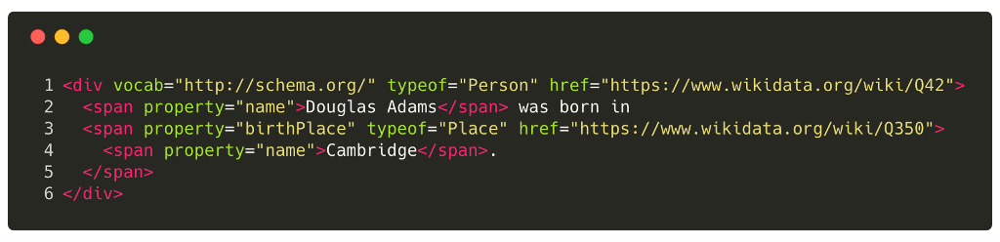
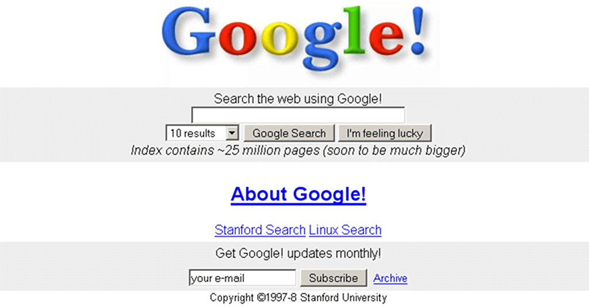

+++
title = "Hitchhiker's Guide To Structured Data"
date = 2018-04-03

[taxonomies]
tags = ["structured data","wikidata","contentful","extension","douglas adams","hitchhiker","guide","galaxy","semantic web","rfc1118"]
categories = ["default"]

[extra]
origin_url = "https://www.contentful.com/blog/2018/04/03/hitchhikers-guide-to-structured-data/"
#long_title = ""
has_hero = true
#image_alt = "Why am I here? What’s my purpose in life? — What do I mean by who am I? — — — Oh no, not again."
image_alt = "What have a bowl of petunias and a whale to do with structured data? 🤔"
+++

<span class="correction">A tiny journey to the <del data-text="flower pots"></del><ins>building blocks</ins> of the semantic <del data-text="whale"></del><ins>web</ins> and how they make our lives much easier.</span>

<!-- more -->


“There is a theory which states that if ever anyone discovers exactly what the Universe is for and why it is here, it will instantly disappear and be replaced by something even more bizarre and inexplicable. There is another theory which states that this has already happened.”




When I started using computers, I never thought about if and how they could help me to do things — and if that in turn would improve my life. I automatically assumed that we invented tools, machines, devices, phones, computers, and so on because we wanted to make our lives better, and to think less about tedious tasks by making the complex and especially complicated ones easier and more usable.

In the late 90s I not only learned but experienced that computers are connected. There was this thing called internet, mostly advertised in the form of WWW, the world wide web: gazillions of documents more or less linked to each other. Mostly plastered with flashy animations saying that this place is under construction. And the `<marquee>` tag made us feel as important as breaking news or a stock market ticker.


Ah, yes, the good old internet. In the beginning quite static and mostly text, but it became richer, more versatile, dynamic, and included images, audio, and video. Besides the static sites, we built web apps, APIs and made the internet a place to interact with each other and with machines.

### Nowadays our fridge "Marvin" can tell us via Twitter that he feels quite empty and sad

As a kid I read tons of books, mostly fiction, of course, but I remember I visited our library in the village quite often and borrowed books explaining the world to me. But I consumed so much, I couldn't keep all the information in my head, nowadays I'm not significantly more knowledgeable than decades ago. I remember bits and pieces, but more importantly, I usually remember where I need to look for the actual data to fill in the gaps.



I grew up with Google from the beginning. And while the old and manually maintained catalogs and directories were a good starting point to explore the digital universe, search engines made my life easier. Now I didn't even need to keep an index and graph of information fragments in my head anymore, I could shift to the skill of asking the right questions.

But there are a few problems with most general purpose search engines. The easiest way to build an index is to crawl the internet and grab the full text of every page discovered and connect it to keywords. Later when somebody searches for this keyword they will get a huge list of results. The algorithms became smarter, the better you can formulate your query, the more relevant and condensed the list will be.

But if you think about it, you can already ask very specific questions, and most search engines wouldn't really be able "to get it" right from the beginning.

### "What are the books the author Douglas Adams has written?"

If you would have tried this maybe 10 or even just 5 years ago and you got lucky, then some result on page one would have pointed you to an article about his publications. If you're not using Google or WolframAlpha the situation is still quite disappointing.

Today I'm quite impressed how this works out:


As you can also see, the first organic result is about the author on Wikipedia, only the second one is close to what I was asking. But the top bar with the book covers is rocking it! _(I first tried with Google.de and there it was just the 3rd result.)_

And I will make a bold statement here: giving you such specific and contextually relevant information is not possible solely based on some full text search index; I believe this was driven by structured data (and potentially stored in a graph database … maybe).

_My internal QuickCheck program narrowed it down to **"douglas adams books"**, but this is not the point (although parsing the input of a search box is probably a nice adventure on its own)._

We can further decompose our query and figure that it consists of a tuple: **"douglas adams"** and **"books"**. The first one describes the name of a person, the second one describes an entity type, and obviously we want to find a connection between this very person and the books he wrote. Since people rarely mentioned which books they have read, the query parser can already make an educated guess here and put as a relationship type a **"has written"** (also "has published" could work).

Or expressed in a pseudo query language and very simplistic:

```sql
SELECT * FROM books WHERE author = "Douglas Adams"
```

Of course, first you would need to resolve an actual author/person entity from your database:

```sql
SELECT id FROM people WHERE name = "Douglas Adams"
```

And then you realize that your people table/database could have multiple entries, and you would try to filter based on occupation or hobby. Maybe you have them ranked by popularity and will just take the highest ranked entry. Another option is to resolve the full query for each person and check which one has written the most books (if any at all) and use this one.

Whatever the approach is, you need to have your data stored in a structured way. And if you want to build a search engine, a knowledge database, or any kind of application querying and presenting such information (but not storing all the information itself) you need to rely on other sources providing them in a machine consumable way.


The idea of structured data and a semantic web is not new. And if you have used any blogging software then you also used some aspects of structuring: categories and tags.

Depending on your needs you even introduced your own taxonomies to describe and differentiate your articles. As an example: you're a movie reviewer and classify your reviews based on mood, target audience, and genres; all of these dimensions help you to describe your data, make it more discoverable, support consuming systems, and directly or indirectly give your readers more context and meta data, usually in a quicker and easier way, so they can decide if they want to dive deeper into your blog or look somewhere else.

The article previews/cards on Facebook and Twitter are also driven by structured data. When you look into the source code of some HTML pages you can spot some interesting meta tags with names or properties like `"og:title"`, `"twitter:creator"`, or `"article:author"`. They are used to fill the pieces of the preview. And to be honest — you will most likely click on a blog post when it has a nice cover image and description line won't you?


It took us years to bring in more data, or to take advantage of the full potential of structured data, but nowadays this concept is the foundation of the web. Even with AI on the rise machines can do their job best if they can process the data in a structured way.

I think the art is to display content in a pleasant, human-readable manner and unobtrusively enrich it with machine consumable semantic information. This so that we can build interfaces and applications that can make sense of all of the data, and then visualize it in a different and more approachable way.

If you want to see what structured data can look like, then head over to wikidata:


These entity pages are very formal and not the most beautiful ones to read about a person's life, but they contain very valuable information by describing what this entity is about and what kind of relationship it has to other entities.

Such data is designed to be consumed by other services. For example the infoboxes on the right side of Wikipedia articles are mostly supplemented with wikidata information.

Some people have built tools to nicely visualize such data:


### How could you use the structured data from wikidata for your own project?

You have built a website for your international book club. It comes with a knowledge base, which supports already 42 languages. While managing the content for the authors and books is pretty easy with Contentful, you realize that localization is sometimes painful, because you have a hard time to figure out what the translations of each person's name are.

#### Don't panic!

A friend of yours comes up with the idea to create a UI extension for Contentful, where you can look up the wikidata and automatically fill the translation fields for the names and other common properties. She has even developed a first prototype for you:

[](https://github.com/asaaki/cf-wikidata-ui-extension-example)
<small>[github.com/asaaki/cf-wikidata-ui-extension-example](https://github.com/asaaki/cf-wikidata-ui-extension-example)</small>

You really like it and start to think about how to automate a lot of other steps. For example the extension could fetch all the known books and create drafts for each of them and link them back to the author entry. Since wikidata also provides links to other Wikimedia services you could store them with your knowledge base articles as well. You integrate a lot of links to other sites and maybe want to create some kind of preview box similar to Twitter Cards.

With well maintained structured data the possibilities are unlimited. So, go out, explore, and build awesome stuff.

> _“Curiously enough, the only thing that went through the mind of the bowl of petunias as it fell was Oh no, not again. Many people have speculated that if we knew exactly why the bowl of petunias had thought that we would know a lot more about the nature of the Universe than we do now.”_ \
> —Hitchhiker's Guide To The Galaxy


“Curiously enough, the only thing that went through the mind of the bowl of petunias as it fell was Oh no, not again. Many people have speculated that if we knew exactly why the bowl of petunias had thought that we would know a lot more about the nature of the Universe than we do now.”


_**So Long, and Thanks for All the Fish!**_ 🐟
