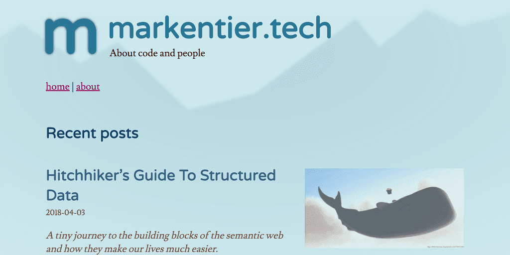

+++
title = "Minimalism, Focus, Clean"
date = 2018-04-13
tags = ["minimalism","focus","clean","redesign","design","webdesign"]
category = "default"
[extra]
#origin_url = ""
long_title = "Minimalism, Focus, Clean - A Redesign"
has_image = true
has_hero = true
image_alt = "Some coffee, code, and creativity as well as bravery for cutting and chopping — redesign cycles"
+++

Start with whatever you have, but don't stop reaching for something better. Why I love minimalistic and simplistic web designs.

<!-- more -->

### One: Nothing is forever

A few days ago I pointed a colleague to my freshly hatched blog, because I wanted to show him my recent post. In the end we didn't even chat about the post, but web design and the job (he's a web designer), challenges and opportunities and interesting stuff to do and creativity and the past and the kind reminder that I'm not the youngest anymore. What kept nagging in the back was the comment about my (now past) design.



> Oh man you need need need to update your site
>
> Want some design help on that bitch?

As much as I appreciate the help and support, but especially for my personal project I tend to do as much as possible on my own. Also taste is highly subjective; I live in Berlin, Germany, I see stuff, I know what I'm talking about. And I do not need to agree with the style and display of others and others' work. I nod (or shrug), I go, and probably forget about it ten minutes later anyway.

But there was a point to the above message. Something he couldn't even know. The design was a temporary solution, and I dug it up from a 4 years old proof of concept work I've done. It was the quickest way to get my site up and running without looking too shabby. I didn't need to seek for a pre-made design somewhere else and I didn't need to spend too much time on creating one from scratch.

While an old design doesn't need to be bad at all, mine wasn't really finished and fully thought through though. And so this sparked the urge to do something about it.

I also knew that I wanted to change the logo independently from a redesign, but now all things came together.

### Two: Anything is possible

I love minimalism, I really do. And I wish I could follow this principle a bit more in my daily life, for now the digital one needs to be sufficient enough for this.

Not all my previous designs and themes were minimal, simple, or even easy to use. Some were artistic; I think in the early 2000s artsy, graphical and very detailed themes were a thing. Sadly I forgot to bookmark (and screenshot) some of my favourites, I cannot even remember the names of the people, so no hint how to find them again. Well, it's history anyway.

### Tree: Something is changing

...

[](/m.svg)

```svg
<svg xmlns="http://www.w3.org/2000/svg" viewBox="0 0 1024 1024">
  <path fill="none"
    stroke="#0c1328"
    stroke-linecap="round"
    stroke-linejoin="round"
    stroke-width="64"
    d="M480 506v208-128s0-72 64-72 64 72 64 {…}"/>
</svg>
```

> M480 506v208-128s0-72 64-72 64 72 64 72v128-128s0-72 64-72 64 72 64 72v128-128s0-72 64-72 64 72 64 72 1 85 1 128c-1 28-24 54-24 54-126 161-348 207-527 111-179-97-262-309-196-501 66-193 261-309 462-275 200 33 347 206 348 409

### Four: Everything is evolving

…