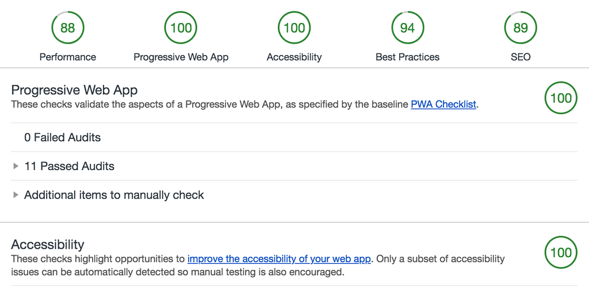

+++
title = "Progressive Web App"
date = 2018-04-01

[taxonomies]
tags = ["progressive","web","application","pwa","service worker","offline","caching","performance","speed","optimization","fast","google lighthouse"]
categories = ["default"]

[extra]
long_title = "Progressive Web App - even for a static site!"
has_hero = true
image_alt = "markentier.tech is a Progressive Web App (PWA) — Nope, not a joke!"
+++

This site is a Progressive Web App now, too. What does it mean and why are PWAs so cool? Main reason: it is about speed!

<!-- more -->



Progressive Web Apps (PWAs) are web applications that are regular web pages or websites, but can appear to the user like traditional applications or native mobile applications. The application type attempts to combine features offered by most modern browsers with the benefits of a mobile experience.


I haven't really followed the development of **Progressive Web Applications** (short: `PWA`) for quite some time. And I think the last time I experimented with anything around this topic was, when _Application Cache_ (or [AppCache][appcache]) was still a thing. So yeah, long time ago.

I have forgotten about web site/app optimization, simply because I had no real web site to build and maintain for years. The sites I had were either abandoned or I didn't care so much about the performance of them.

The very first question a lot of people might ask is:

### Why even bother to read about it, if all I'll make will be a static site anyway?

Well, if you do care about web performance and speed, you might want to consider all the tools available to you.

If you in full control of the output (HTML, CSS, JS, images, fonts, ...) you have already lots of opportunities.
You can minimize and compress the files. The HTML, CSS, and JavaScript stuff is fairly easy, for all of them exist online services or CLI executables.

But do not forget your assets like images (and audio/video if you host them yourself), most of them can be made smaller. PNG and JPEG are still the most used image file formats (well, also GIFs for animations), [WebP][webp] is there, but I haven't really seen serious usage yet. Each format usually supports either lossless and/or lossy compressions. I still prefer PNG as my standard image format, and I like that there are tools out there helping me to squeeze out the last tiny bit to get to a pretty small file size.

### Tools for minification and compression

Before I come to the PWA part, let's have a look at what can (and should) be done, no matter what kind of website you have.

#### HTML

So far I will only mention my go-to tool here: [tidy-html5][tidy]. I [elaborated a bit further in my last post][tidy-post], when I wrote about changing my static site generator.

On the other hand the overhead of bloated and whitespace cluttered HTML pages is proably not the biggest issue when it comes to fat sites.

#### Stylesheets (CSS) and JavaScript (JS)

Instead of recommending a specific tool I'd rather point to projects like [webpack][webpack], [parcel][parcel], or your favourite static site generator of choice with proper support. Also if you use a service like [Netlify][netlify], that you can enable asset optimization and they will take care of the byte crunching for your, the same goes for the

Even if you use WordPress I know that people have written nice plugins to help you with such task. Nobody needs to do this by hand anymore.
The same goes for images as well, but for reasons I dedicate it its own section:

#### PNG and other images

While services like Netlify claim to support compression of images, I'm pretty sure they will have trade-offs to publish and deliver your site faster.
Since images are one of the biggest pieces of the total page weight, I think they deserve more attention beforehand.

First of all do you know which size you need already? Do not simply put your desired image unaltered into your blog post. Unless you always choose the too small images, you probably end up embedding way too huge files instead. Nobody really needs that 3000x5000 photograph when reading your article. If you want to provide them that original file for later usage, give it a link to it for download. So resize the image to your needs. Consider all the usual presentation layers. Most people can live with a 1024 pixels maximum on either height or width, depending on your theme you might be able to use even smaller default sizes.

_I use an aspect ratio of `2:1`, so my default image dimension is `1024x512`, which is used for my cover and further images. I use this maximum as default even though my article body width is a bit smaller. The reason is that the cover image is also used for [Twitter Cards][twitter-cards] (and Facebook) presentation. Both platforms either support or suggest bigger sizes, but for now I think this is overkill._

As said, I love PNGs, even though for photos the JPEG format might be better suited.
Anyway there are a bunch of tools for PNG optimization.

The most well-known is [ImageMagick][imagemagick], which can be used for a lot of different image formats. I used it especially for resizing and generating my thumbnails of the cover images. Resizing down to the visibly rendered size saves already tons of bytes and therefore bandwidth!

Speaking of thumbnails I go even further, because they cannot be only small in dimensions, but highly reduced and compressed, since they serve as a visual hook, but do not need to be the prettiest pictures ever.

So something neat is the reduction of the color palette with [pngquant][pngquant]; people familiar with GIF optimization now that this helps already a lot.

Second is done by [optipng][optipng]. *pngquant* already can do a lot of heavy lifting, so maybe the companion doesn't so much afterwards, but maybe it will find a file for further optimization.

Initially I also had [pngcrush][pngcrush] in the pipeline, but after checking the actual byte size of the files I saw that it mostly increased afterwards; I removed it, because I'm not interested in de-optimization of my content. 😅

For GUI lovers there is a handy tool for macOS users: [ImageOptim][imageoptim]. This works on a bunch of image file formats and with quite some tools under the hood.

### Caching

Minimization and compression are just the beginning of a fast served site. Once all the files are up on a server, waiting to be delivered all around the world, they also do not change that often. Especially your very static pages with all the assets are unlikely to change (like blog posts and about and imprint pages).

So, to prevent a constant flow of all the bits and bytes for each request, we want to cache them, and ideally as close to the user as possible, so that the next time they request the exact same data, they are served from their devices instead. This becomes highly efficient for repetitively used and requested files like CSS and JS, which are shared across your whole site. Also your logo and header images do not need to travel each time that way.

Intermediate steps are server-side caches and CDNs by the way, but I'm not focussing on this right now.

Also: Caching in itself is a tricky story and should probably deserve its own article.

Generally speaking the [Cache-Control header][cache-control] is a good starting point and helps browsers to determine, what and for how long it should try to keep a file in at hand instead of fetching it from the internet.

### Next level: Progressive Web

Although I have heard of _Progressive Web Application_ already, I never paid much attention to it. I surely thought that it might be cool to look into this topic, once I figured out a web app project. A static site was definitely not a trigger. I could not have been more wrong.

When I run the **Audits** tool in the Google Chrome developer tools, I had no idea what this [Lighthouse][google-lighthouse] stuff is. I remember that in previous version of Chrome, there was this _PageSpeed Insights_ tab, which is deprecated and only available as a [web service][pagespeed] nowadays. It's still a useful tool on its own. But **Lighthouse** provides much more performance and optimization data.

So when the report was generated I was a bit confused that it had this _Progressive Web App_ section. Sure, some sites might need this information, but the whole internet is not only about dynamic apps, is it?

Well, it was about time to dive into this previously neglected topic again. I read and learned about the [Web App Manifest (manifest.json)][web-app-manifest] and the [PWA Checklist][pwa-checklist].

One important step for the baseline was:

> All app URLs load while offline

With the suggestion to fix it by doing this:

> Use a Service Worker.

Oh, I also read about [them][service-worker], but for the same reason above I just ignored this topic, too. If you want to learn what you can do with them, check out [serviceworke.rs][sw.rs]

As a starter I went for the [pretty simple setup provided by Google][sw-js]. But also iterated further. Tell me if something doesn't work out well or the site just looks ugly (unstyled).

The cool thing is, that it not only makes your site perform faster and cache items, but also provides offline functionality.

The screenshots above are an example of how it would look like, if you decided to add _markentier.tech_ to your homescreen.
Coloring the address bar is also a nice gimmick.

Until now I cannot tell you much more about PWAs yet, since I'm learning the stuff right away on the go.

I encourage you to look into this topic as well. I hope I provided you with enough links to start your own journey.

**Happy Easter! 🗿🥚🐰**

---

_PS: Sorry, no April Fools' Jokes or funny anything at all here._

[appcache]: https://www.html5rocks.com/en/tutorials/appcache/beginner/
[cache-control]: https://developer.mozilla.org/de/docs/Web/HTTP/Headers/Cache-Control
[google-lighthouse]: https://developers.google.com/web/tools/lighthouse/
[imagemagick]: http://www.imagemagick.org/
[imageoptim]: https://imageoptim.com/mac
[netlify]: https://www.netlify.com/
[optipng]: http://optipng.sourceforge.net/
[pagespeed]: https://developers.google.com/speed/pagespeed/insights/
[parcel]: https://parceljs.org/
[pngcrush]: https://github.com/Kjuly/pngcrush
[pngquant]: https://pngquant.org/
[pwa-checklist]: https://developers.google.com/web/progressive-web-apps/checklist
[service-worker]: https://developer.mozilla.org/en-US/docs/Web/API/Service_Worker_API
[sw-js]: https://github.com/GoogleChromeLabs/airhorn/blob/master/app/sw.js
[sw.rs]: https://serviceworke.rs/
[tidy-post]: /posts/2018/03/from-cobalt-to-gutenberg/#tidy-html5
[tidy]: http://www.html-tidy.org/
[twitter-cards]: https://developer.twitter.com/en/docs/tweets/optimize-with-cards/overview/abouts-cards
[web-app-manifest]: https://developer.mozilla.org/de/docs/Web/Manifest
[webp]: https://developers.google.com/speed/webp/
[webpack]: https://webpack.js.org/
[wp-pwa]: https://en.wikipedia.org/wiki/Progressive_Web_Apps
