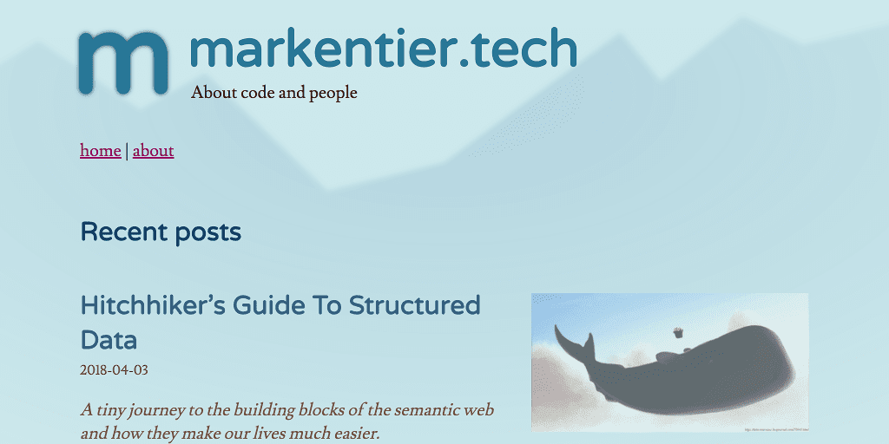
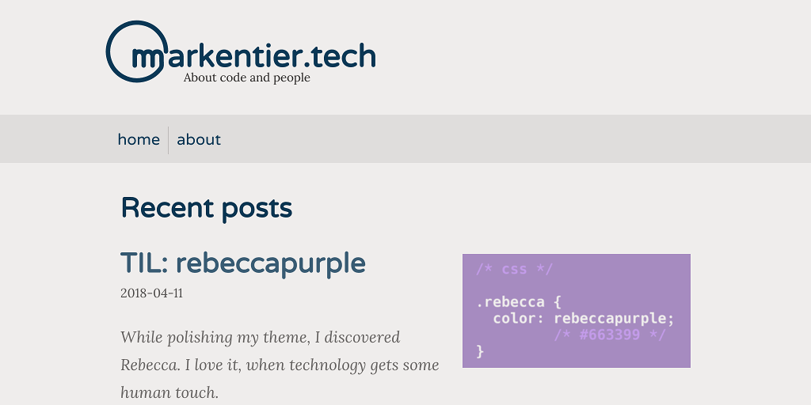
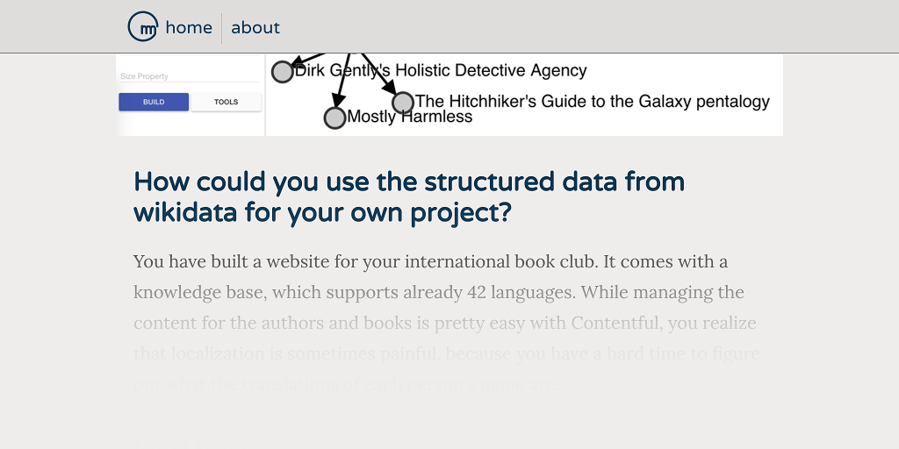

+++
title = "Minimalism, Focus, Clean"
date = 2018-05-01

[taxonomies]
tags = ["minimalism","focus","clean","redesign","design","webdesign","svg","vector","graphics","simple"]
categories = ["default"]

[extra]
#origin_url = ""
long_title = "Minimalism, Focus, Clean - A Redesign"
has_image = true
has_hero = true
image_alt = "Some coffee, code, and creativity as well as bravery for cutting and chopping — redesign cycles"
+++

Start with whatever you have, but don't stop reaching for something better. Why I love minimalistic and simplistic web designs.

<!-- more -->

### One: Nothing is forever

A few days ago I pointed a colleague to my freshly hatched blog, because I wanted to show him my recent post. In the end we didn't even chat about the post, but web design and the job (he's a web designer), challenges and opportunities and interesting stuff to do and creativity and the past and the kind reminder that I'm not the youngest anymore. What kept nagging in the back was the comment about my (now past) design.



> Oh man you need need need to update your site
>
> Want some design help on that bitch?

As much as I appreciate the help and support, but especially for my personal project I tend to do as much as possible on my own. Also taste is highly subjective; I live in Berlin, Germany, I see stuff, I know what I'm talking about. And I do not need to agree with the style and display of others and others' work. I nod (or shrug), I go, and probably forget about it ten minutes later anyway.

But there was a point to the above message. Something he couldn't even know. The design was a temporary solution, and I dug it up from a 4 years old proof of concept work I've done. It was the quickest way to get my site up and running without looking too shabby. I didn't need to seek for a pre-made design somewhere else and I didn't need to spend too much time on creating one from scratch.

While an old design doesn't need to be bad at all, mine wasn't really finished and fully thought through though. And so this sparked the urge to do something about it.

I also knew that I wanted to change the logo independently from a redesign, but now all things came together.

[](/m.svg)

### Two: Anything is possible

I love minimalism, I really do. And I wish I could follow this principle a bit more in my daily life, for now the digital one needs to be sufficient enough for this.

Not all my previous designs and themes were minimal, simple, or even easy to use. Some were artistic; I think in the early 2000s artsy, graphical and very detailed themes were a thing. Sadly I forgot to bookmark (and screenshot) some of my favourites, I cannot even remember the names of the people, so no hint how to find them again. Well, it's history anyway.

In the end I always come to enjoy a design and layout which is not overloaded with stuff and cruft. Sometimes I will add something here and there. And just a bit later I think I should remove something again.

Also: minimalism doesn't necessarily mean total emptyness or absense of everthing. But I came to love the huge blanks, and the vast endlessness of the plains.

```svg
<!-- basic SVG logo markup for markentier.tech -->
<svg xmlns="http://www.w3.org/2000/svg" viewBox="0 0 1024 1024">
  <path fill="none"
    stroke="#0c1328"
    stroke-linecap="round"
    stroke-linejoin="round"
    stroke-width="64"
    d="M480 506v208-128s0-72 64-72 64 72 64 {…}"/>
</svg>
```

### Three: Something is changing

I love vector graphics. And so I love SVG. I remember to have always liked this image format since discovery. It was quite sad, that it also took quite some time to have proper cross browser support. If you ignore old IEs, then the present day situation is awesome. SVG v2 is not there yet (and I really want to get rid of  the `xlink` namespace), but the currently implemented spec is already good for a lot of use cases.

One perfect example are logos and icons. As you already see, my website's logo is delivered and rendered as SVG, I couldn't get it smaller than that anyway, any PNG, GIF or JPEG would always be much, much bigger than the following path definition:

> M480 506v208-128s0-72 64-72 64 72 64 72v128-128s0-72 64-72 64 72 64 72v128-128s0-72 64-72 64 72 64 72 1 85 1 128c-1 28-24 54-24 54-126 161-348 207-527 111-179-97-262-309-196-501 66-193 261-309 462-275 200 33 347 206 348 409

Yes, exactly, this is all. It is probably the most compact version I could use. Hence the usage of a 1024x1024 viewBox and big numbers, just to avoid decimals, which carry the extra dot. This is a pro-tipp btw, always design your stuff on a huge canvas 1000 pixels or bigger in dimensions. Then with tools like SVGOMG (or already in your vector graphics program) you can save the file with zero decimals (so only integers) without loosing significant information.

If you want to get more excited about SVGs:

{{ youtube(id="lMFfTRiipOQ") }}

{{ youtube(id="ADXX4fmWHbo") }}

There are definitely more, but above videos should be a nice starting point. I might come back to this topic in the future.

<div class='img-with-borders'>



</div>

### Four: Everything is evolving

The screenshot above might look a bit weird, because it fits perfectly into the current design (I added a border so it doesn't look too floaty).

I think this represents an interpretation of minimalism. At least one I like. There didn't went too much process or sciene into it, at least not consciously. Of course, I'm aware of some color basics, contrasts and a basic understanding of accessibility. It won't be perfect yet. And probably I won't bake in some changes you'd like to see.

But I do believe that my articles should be consumable without too much distraction or fatigue or strain. Since it is heavily color range reduced, color blind  people (or with partial deficiency) should be able to read and navigate the site without loosing anything or getting confused. I haven't tested screenreaders, but I hope I don't use design magic which would impact your experience here.

<div class='img-with-borders'>



</div>

I also still work on the performance aspect of it. And I also push for more modern browsers. Since it is my personal blog, I think I can afford to "loose" some customers, or at least give them not the full pleasure by not being always fully backwards compatible.

If you have questions or just want to know in more detail how something works here, ping me on [twitter](https://twitter.com/asaaki) or open an issue at the [repo](https://github.com/markentier/markentier.tech/issues) for this site, I'm happy to explain, glad if you can learn something, and I welcome feedback and corrections.
