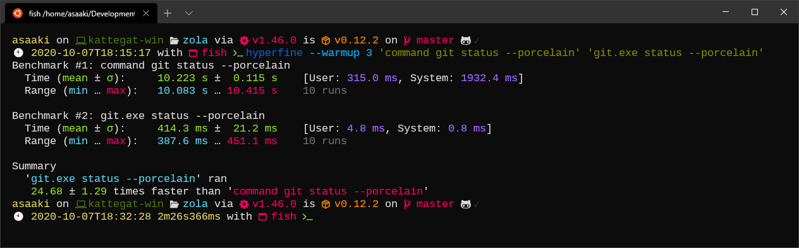

+++
title = "Faster git status under WSL2"
date = 2020-10-07

[taxonomies]
tags = ["git", "status", "WSL", "WSL1", "WSL2", "Windows", "subsystem", "linux", "speed", "slow", "/mnt/", "Windows 10", "starship", "git_status", "Win10", "Microsoft", "VCS", "version", "control", "system"]
categories = ["default", "notes"]

[extra]
has_hero = true
image_alt = "Use git.exe when working in repositories under /mnt/…"

[[extra.suggestions]]
text = "How you can manage multiple GitHub accounts on a single computer"
link = "/posts/2021/02/github-with-multiple-profiles-gpg-ssh-keys/"
[[extra.suggestions]]
text = "How you can speed up your Rust build times under WSL2"
link = "/posts/2022/01/speedy-rust-builds-under-wsl2/"
+++

With WSL2 filesystem performance degraded for the mount points of the Windows host. Here's a tip to speed up `git status` again.

<!-- more -->

_tl;dr: [jump to the **solution.**](#solution)_

For personal projects I work on my PC. And to my own surprise nowadays solely on my Windows 10 installation. While I still have my Linux on another hardrive, I haven't booted into it for half a year now. The reason why it is possible, specifically if you do have Linux focused projects, is [`WSL` (Windows Subsystem for Linux)][wsl]. While I have experimented already with **WSL 1** for some time, I switched to **WSL 2** since it became generally available in Windows 10 Version 2004 (apparently it was [backported to 1903 and 1909][wsl2back]).

My main reason for switching to WSL2 was much better Linux support (kernel and syscall stuff), and for a long time everything was fine. I didn't even notice the [performance hit across OS file systems][wslcomp].

But lately something was bothering me. And it started with a related but independet issue in my favourite shell prompt tool [starship][starship]: `git_status` became extremely slow in repositories of some size. Since it was my prompt every command execution in a git-managed project was slow, better yet, it took just seconds until the prompt came back. First I didn't know what the issue was, until I discovered [issue 1617][starship-1617] (and in [another issue][starship-1470] it is mentioned that an update to v0.45 will make it even slower, as well as a [solution idea][starship-1446] to mitigate it).

So I turned the extension off and ran `git status` manually. But lo and behold: that was still very slow!

[<br><small>(click image for bigger version)</small>](./hyperfine-benchmark.png "hyperfine benchmark of git status, Linux vs Windows")

**10 seconds (Linux git) vs ~400 ms (Windows git.exe)!**

_Aside: [hyperfine][hyperfine] is a nice tool to benchmark CLIs and shell scripts/functions._

What was the problem? Also under Windows in a PowerShell with the Windows version of git, no performance penalty was noticable. I searched around, if there was an issue with git under WSL2.

And then I got reminded about the one line of the comparison table mentioned above:

| Feature | WSL 1 | WSL 2 |
| :--- | :---: | :---: |
| ⋮ | ⋮ | ⋮ |
| Performance across OS file systems | ✅ | ❌ |

Well, the row alone does not really explain how much of a problem this might be.

I was not alone, in the GitHub repo of WSL I found [issue 4401][wsl-4401] which was quickly pointing to [4197][wsl-4197]. Within the lengthy thread there was a very [detailed explanation][wsl-4197-explainer] of the underlying problem, some key statements:

> Windows files are now accessed across the VM boundary, however. […] In WSL2, every operation has to send data to the host, exit the VM, wait for the host to perform the operation (which still involves emulating Linux behavior and the cost of Windows IO operations), send data back to the VM, trigger an interrupt in the VM, schedule the virtual processor to run, and continue executing in the VM.
>
> Essentially, Windows files are now a "remote" file system.

> To make matter worse, to ensure the same behavior as WSL1, we don't use any caching.

> Without caching, it means every "stat" operation has to make a round-trip to the host (multiple, actually, partially because of how Linux VFS works, and partially because of how 9p works).

Leaving with one recommendation in the end:

> So yes, for now the most important thing is: **if it's at all possible, store your projects in the Linux file system in WSL2.** This will be much faster than anything in WSL1, and gives you the full benefit of WSL2.

Sadly that's not an option I want to follow, as I love to work on my project across OS boundaries. So I have to wait until a performance improvement will land in WSL2 hopefully.

Since `git` is the only very noticable issue for me, I only need a fix for that for now. Luckily someone else had [a great idea how to alleviate the problem][wsl-4401-shfunc] (discovered through a tiny detour to [someone else's dotfiles][shfunc]).

> I came up with a dumb but useful workaround for this specific case. It works because windows git is faster against ntfs and I don't need any linux specific things for git at least.

I took the snippet and adjusted it for my environments.

-----

## Solution

Call the [Windows Git (git.exe)][wingit] command when working in a `/mnt` folder which is a Windows host (NTFS) mount.

**Bash, ZSH, and friends**

```bash
# use Windows' git when working under C:\ drive
function git() {
  if $(pwd -P | grep -q "^\/mnt\/c\/*"); then
    git.exe "$@"
  else
    command git "$@"
  fi
}
```

**Fish**

```fish
function git --wraps git
  if pwd -P | grep -q "^\/mnt\/c\/*"
    git.exe $argv
  else
    command git $argv
  end
end
```

Some explanations:

```bash
pwd -P
```

… returns the current physical working directory with all symlinks resolved. This is great since I have some symlinks for my dev folders, so all machines and VMs have a common structure (well, except for Windows itself).

```bash
grep -q "^\/mnt\/c\/*"
```

… searches for the pattern matching paths starting with `/mnt/c` quietly (`-q`), the exit status will be used for the `if` check. Adjust the pattern if you need different drive letters.

```bash
git.exe "$@" # fish: git.exe $argv
```

… calls the git from Windows. This is one of the benefits of WSL over usual virtualization approaches: Windows allows to execute commands within WSL environments. IIRC it basically executes directly on the Windows host and only communicates back and forth. So git is called on the `C:\...` folder and no filesystem penalty has to be paid.

```bash
command git "$@" # fish: command git $argv
```

Since we're masking the git command with our function, we need a way to call the git executable directly. The linked solutions use explicit absolute file paths, but I don't want to think about if a distro installs it under `/bin`, `/usr/bin`, or elsewhere, I prefer to let the shell figure out where the executable is. `command` is made for that. _Reminder to myself: use command more often!_

-----

So, my starship prompt is not fixed yet, on the other hand I can live without the git status info. Theoretically I could also live without this nifty shell function, since I moved most of my repo management into my [VS Code][vscode] workflows. But sometimes it is nice to do some tasks in a plain shell.

_Also if you're interested in my current development environment on my PC, [ping me on twitter][twitter] and maybe I'll post about it here._

[wsl]: https://docs.microsoft.com/en-us/windows/wsl/
[wsl2back]: https://devblogs.microsoft.com/commandline/wsl-2-support-is-coming-to-windows-10-versions-1903-and-1909/
[wslcomp]: https://docs.microsoft.com/en-us/windows/wsl/compare-versions
[starship]: https://starship.rs/
[starship-1617]: https://github.com/starship/starship/issues/1617 "Starship takes over 50 seconds to load with some git repos"
[starship-1470]: https://github.com/starship/starship/issues/1470 "On v0.45.0 the git_status module is about twice as slow as on v0.44.0"
[starship-1446]: https://github.com/starship/starship/issues/1446 "Replace the use of git2 with calls to the Git CLI"
[hyperfine]: https://github.com/sharkdp/hyperfine
[wsl-4401]: https://github.com/microsoft/WSL/issues/4401 "git status is slow in WSL2"
[wsl-4401-shfunc]: https://github.com/microsoft/WSL/issues/4401#issuecomment-670080585
[wsl-4197]: https://github.com/microsoft/WSL/issues/4197 "[wsl2] filesystem performance is much slower than wsl1 in /mnt"
[wsl-4197-explainer]: https://github.com/microsoft/WSL/issues/4197#issuecomment-604592340
[shfunc]: https://github.com/rajyan/dotfiles/commit/43ec3e33db053d9dd82efa5ed0fcccdb776c5380
[wingit]: https://git-scm.com/download/win
[vscode]: https://code.visualstudio.com/ "Visual Studio Code"
[twitter]: https://twitter.com/asaaki
