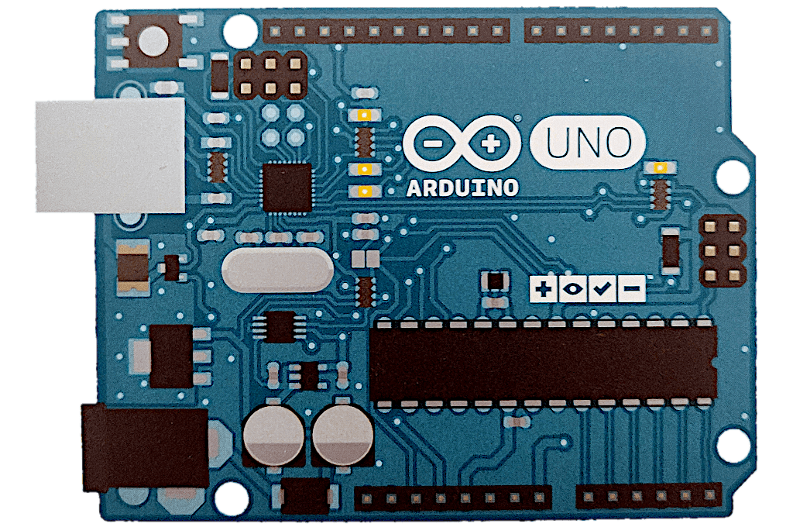
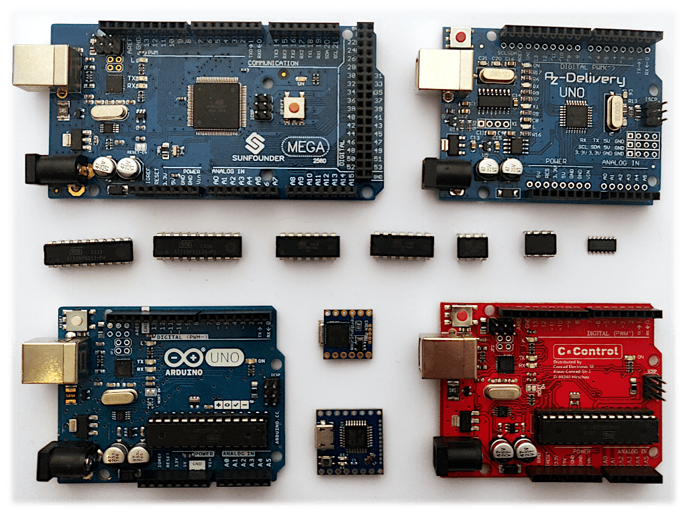
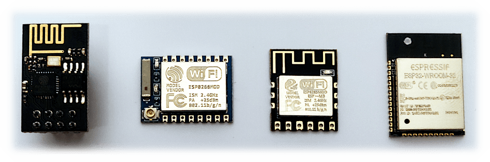

+++
title = "Rust 2021"
date = 2020-10-04T10:04:00Z

[taxonomies]
tags = ["rust", "2021", "edition", "embedded", "nrf5280", "nrf-rs", "arduino", "platformio", "avr", "attiny", "atmega", "esp32", "esp8266", "async"]
categories = ["default"]

[extra]
#origin_url = ""
#long_title = ""
has_hero = true
image_alt = "Thinking about the future and a potential new Rust 2021 edition"
# custom_delimiter = "· · ⚙ · ·"
custom_css = """
  .article-body > p:first-of-type::after, hr::after { display: block; opacity: .25; margin: 1.5rem auto 0 auto; height: 2rem; width: 2rem; content: url('/i/rust.svg'); }
  .red { color: var(--link-hl-color); }
"""
+++

Collecting my thoughts around what I would want from Rust in 2021.
<!-- , the language, the ecosystem, the community.  -->

<!-- more -->

If you count the birthday of a programming language only after it hit its 1.0 (stable) release, then in 2021 **Rust** will turn 6 years old. Of course, the language has a much longer history.

In 2006 Graydon Hoare started it as a personal project and in 2009 Mozilla sponsored it (and since 2010 it became an official thing). So first of all: Thank you both, Graydon and Mozilla, for bringing that quite awesome language into existence!

Yes, admittedly it has a very steep learning curve. As someone who only plays with it every once in a while, has no long term projects yet to use it, and also considers themself as a slow thinker, I still appreciate all the things this language, ecosystem, and community has to give. There are still many things which will take me a long time to grasp and turn into a second nature, but as a mostly end user I feel already productive nevertheless.

And yet, we shall not stop improving. Learning, growing, developing.

_So what do I want from Rust in the next year and beyond?_

-----

## [Embedded Rust][embedded-rust]

The short summary would be **to have an [Arduino][arduino] or [PlatformIO][platformio] like ecosystem** at one point. And I know that there is already a loooot of development going on. Just recently I signed up for some Embedded Rust training/workshops, and as a sponsor to the [Knurling project][knurling-rs] I also get access to another opportunity called [Knurling Sessions][knurling-sessions]. _(Psshht, if you become a [sponsor][knurling-sponsor], you also get immediate access to them.)_

Tools like probe-rs' [cargo flash][cf] and [cargo embed][ce] are a great foundation for some chip families and series like [nRF][nrf]52s, [STM32][stm32]s, and [LPC][lpc]8xx. The [rust-analyzer (RA)][ra] is an incredibly powerful tool to bring you the IDE experience.

So, while the tool landscape is growing and evolving, I still feel a bit lost. If you're a beginner in both Rust and Embedded, it will be probably overwhelming to figure out what devices and equipment to buy and how to go from there. Sure, the embedded book focuses on one particular hardware, but there are quite some holes and blind spots in the guide; being on a Windows system you do feel a bit left behind, something the Arduino folks have understood.

Also speaking of Arduino comparison: Even if their IDE is not the best in the world, the combination of software and hardware makes it incredibly easy to get started and have very quick success moments. Install IDE, plug in the board, select the Blink sketch and upload to your device. Even as a slightly seasoned developer and person with many years of experience in computer and tech I love such low barrier entries a lot.

Keep in mind: after the newcomers had their first blinky moment, they still have to learn a lot about the language and the microcontroller.

The folks at _Ferrous Systems_ walk already in that direction ([defmt][defmt] is really nice btw), but **I believe we still need that well integrated bundle.** A dedicated development/starter board + predefined IDE with examples might be really necessary to get more people into Embedded with Rust. I would be fine if it is build on top of VS Code and maybe even the nrf5280-DK, at least for the first iteration, but we definitely need some kind of installer for all the tools you need to get it started. We need to make it as low friction-y as possible.

_By the way a board with the Arduino Uno form factor would be nice. I know, lately all the newer boards get some smaller shapes. Yet you will probably still find a wide ecosystem around this Uno board like extensions and shields and cases …_

### AVR (ATtiny, ATmega, Arduino)

Furthermore I wait for more first class support of established microcontroller types. For people who worked with Arduino in the past, it would be great to see the [AVR Rust][avr] ecosystem evolving and growing. I haven't looked at the latest quickstart guide, but I think it is still not very beginner friendly yet. **AVR** might not be an actively developed branch in the microcontroller landscape anymore, but there are tons of devices out there. I have probably accumulated dozens to hundreds of some ATtiny chips and ATmega boards (they can be extremely cheap when bought in bigger quantities). And sometimes, a tiny 8bit unit will just do. Sure, I can use them with C++ tooling, but do I really want to?

### Xtensa (ESP32, ESP8266)

Another corner is **Espressif's ESP32 and ESP8266** (both chip series based on the Xtensa architecture). I think one reason these chips became so successful was also due to the integration into the Arduino ecosystem, at least that's how I got started with them. And PlatformIO has good support for them as well. So yet again, we need to build up the compiler support, but also make it easy to get started with them using Rust. Same as with AVR based microcontrollers, I have plenty of ESPs lying and flying around, all waiting to get some Rusty code onto them. Recently there was some progress and the [quickstart guide][qs-xtensa] was updated, but you still have to be very dedicated and love to compile the needed toolchain yourself. _Also checkout the [esp-rs GitHub organization][esp-rs] for more crates and tools._

-----

## Error handling

Completely independent from embedded development is this point about a more guided and standardized way of how we should deal with errors in our libraries and applications. There are now plenty of crates to help and support us. But for me this also means: too much choice, so which one to pick? What approach will be more future proof? Some people in the list below have dug deeper into that topic though, so if you're interested then check them out.

_There has already formed an [Error Handling Project Group][ehpg]._

## Async ecosystem

Currently I find it still very annoying to have this divide between **[tokio][tokiors]** and **[async-std][asyncrs]**. Both are great projects, but since also library authors pretty much hardcoded their preferences, it is sometimes hard or impossible for users to mix and match. I'm all pro multiple executors and runtimes, there's probably even a need for more than one. But let's find good abstractions between them, so it's easier for me and others to use. And I don't want to have take sides.

## Advanced beginners and intermediate level materials

After you get over the first hurdles of the language, it might become difficult to advance in a pace you find appropriate. To make this point short: there's now a lot of material for the curious and for beginners, there's also material for extremely enthusiastic and expert level people, but the middle ground still feels like a barren land. There are some great folks creating awesome content on YouTube. And I just wish to be more of it. After watching Jon Gjengset ([»Crust of Rust« series][yt-cor]) and [Ryan Levick][yt-ryan]'s stuff, I really want more of that. So, please, if you feel comfortable with writing or creating videos, help others like me to grow further.

## Pet peeve: Blockchainers

This is a very personal point, but I wish not everyone would think of blockchain and cryptocurrency stuff the first time they hear about Rust and where it's used. Also the job market seems to be quite dominated by this topic; if I wanted to consider a career change (going professional with Rust development) I don't really see good alternatives yet (though IoT/embedded does seem to be a viable option). Can we focus our energy elsewhere and/or more broadly? There are plenty of interesting topics, but I don't believe that "blockchaining" all of them is the right thing to do. To be honest I yet have to see a very good and reasonable project for blockchain technologies besides the hobby gambling with my Bitcoins and Ethereums.

## Anything else?

I'm quite okay with the current development of the tooling so far. `cargo` is probably one of the best I have encountered so far; at least for pure Rust projects there's not much more you could ask for, either it's built in, a cargo plugin away, or merely an alias for more convenience. I don't have need for deeper or better integration to other languages and their build systems.

I mentioned it already above, but to close with it again: [rust analyzer][ra] is the greatest thing that could have happened to Rust developers. Please keep going and improving it! I usually have a quite high failure tolerance, but others might want way better stability. But I definitely do not want to live without it anymore. Oh, and if you're an as happy user as I am, please consider supporting the maintainers ([open collective][ra-oc], [github sponsor][ra-ghs]).

If I could wish for something in 2021, then that rust-analyzer becomes a more official part of the Rust language. I don't know if it should be directly adopted or get some other support (somehow via the to be founded [Rust foundation][rustf] maybe?).

-----

## What others want and wish and envision

Just for myself and others here the collection of blog posts as they appeared so far on [This Week in Rust][twir] ([#356][twir-356], [#357][twir-357], [#358][twir-358]):

* <https://matklad.github.io/2020/09/12/rust-in-2021.html>
* <https://hsivonen.fi/rust2021/>
* <https://llogiq.github.io/2020/09/21/ethics.html>
* <https://estada.ch/2020/9/23/my-rust-2021-wishlist-for-the-2021-roadmap/>
* <https://blog.nindalf.com/posts/rust-2021/>
* <https://longfangsong.github.io/2020/09/07/Rust-2021-Request-for-a-better-patch-in-cargo/>
* <https://haurchefant.fr/posts/what-i-wish-for-rust2021/>
* <https://www.ncameron.org/blog/rust-in-2021/>
* <https://gist.github.com/mark-i-m/57b51099e02f2d1fb4d4a4bf08e92965>
* <https://mbuffett.com/posts/rust-less-error-handling/>
* <https://gist.github.com/pickfire/3bcceeacf0bae22dd9f03c5053a976e3>
* <https://ridiculousfish.com/blog/posts/least-favorite-rust-type.html>
* <https://sam-vente.com/blog/my-rust-2021-wishlist/index.html>
* <https://www.reddit.com/r/rust/comments/imd8b8/my_rust_2021_roadmap/>
* <https://therealprof.github.io/blog/roadmap-2021-arbitrary-size-primitives/>
* <https://therealprof.github.io/blog/roadmap-2021-usable-dev-mode/>
* <https://jyn514.github.io/2020/09/05/Rust-in-2021.html>
* <https://mgrech.dev/whats-stopping-me-from-using-rust/>
* <https://pastebin.com/d6jaxh7n>
* <https://news.ycombinator.com/item?id=24368077>
* <https://raphlinus.github.io/rust/druid/2020/09/28/rust-2021.html>
* <https://www.reddit.com/r/rust/comments/j1ihax/rust_2021_maintain_dominance_on_the_web_easy/>
* <https://www.reddit.com/r/rust/comments/j06zc9/rust_2021_easier_to_integrate_into_existing/>
* <https://www.reddit.com/r/rust/comments/izk75l/rust_2021_continue/>
* <https://raphlinus.github.io/rust/druid/2020/09/28/rust-2021.html>
* <https://blog.carminecrystal.com/rust-2021-features-and-trait-bounds-in-macros.html>
* <https://swatinem.de/blog/rust-2021/>
* <http://jamesmcm.github.io/blog/2020/09/24/rust2021/#en>
* <https://aldaronlau.com/rust-2021/>
* <https://popzxc.github.io/rust-2021>
* <https://christian.amsuess.com/blog/website/2020-09-24_rust_2021/>
* <https://blog.coderspirit.xyz/blog/2020/09/26/rust-2021/>
* <https://blog.thomasheartman.com/posts/rust-2021>
* <https://beyermatthias.de/blog/2020/09/28/rust-2021/>
* <https://blog-dry.com/entry/2020/09/29/135738>

The initial announcement and call for blog posts:

<https://blog.rust-lang.org/2020/09/03/Planning-2021-Roadmap.html>

-----

ℹ️ _This is a link heavy post. Anything broken or not pointing to the right place? [Send me a message via Twitter](https://twitter.com/asaaki) or [open an issue on GitHub](https://github.com/markentier/markentier.tech). Thank you!_

[embedded-rust]: https://rust-embedded.github.io/book/
[arduino]: https://www.arduino.cc/
[platformio]: https://platformio.org/
[knurling-rs]: https://ferrous-systems.com/blog/knurling-rs/
[knurling-sessions]: https://ferrous-systems.com/blog/knurling-sessions-introduction/
[knurling-sponsor]: https://github.com/sponsors/knurling-rs
[cf]: https://github.com/probe-rs/cargo-flash
[ce]: https://github.com/probe-rs/cargo-embed
[nrf]: https://github.com/nrf-rs
[stm32]: https://github.com/stm32-rs
[lpc]: https://github.com/lpc-rs
[ra]: https://rust-analyzer.github.io/
[defmt]: https://defmt.ferrous-systems.com/
[avr]: https://www.avr-rust.com/
[qs-xtensa]: https://github.com/MabezDev/xtensa-rust-quickstart
[esp-rs]: https://github.com/esp-rs
[ehpg]: https://github.com/rust-lang/project-error-handling
[tokiors]: https://tokio.rs/
[asyncrs]: https://async.rs/
[yt-ryan]: https://www.youtube.com/channel/UCpeX4D-ArTrsqvhLapAHprQ/
[yt-cor]: https://www.youtube.com/playlist?list=PLqbS7AVVErFiWDOAVrPt7aYmnuuOLYvOa
[ra-oc]: https://opencollective.com/rust-analyzer/
[ra-ghs]: https://github.com/sponsors/rust-analyzer
[rustf]: https://blog.rust-lang.org/2020/08/18/laying-the-foundation-for-rusts-future.html
[twir]: https://this-week-in-rust.org/
[twir-356]: https://this-week-in-rust.org/blog/2020/09/16/this-week-in-rust-356/
[twir-357]: https://this-week-in-rust.org/blog/2020/09/23/this-week-in-rust-357/
[twir-358]: https://this-week-in-rust.org/blog/2020/09/30/this-week-in-rust-358/
