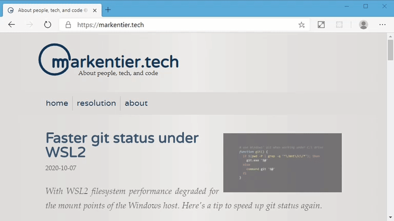
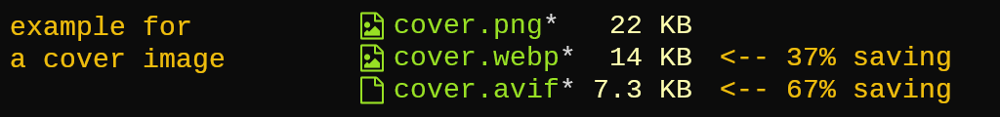
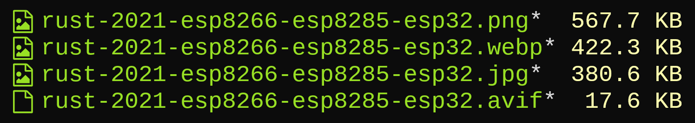

+++
title = "How I wrote JavaScript to avoid JavaScript"
date = 2020-10-14

[taxonomies]
tags = ["javascript", "2021", "frontend", "backend", "website", "webapp", "web", "development", "fast", "speed", "slim", "minimalism", "react", "SSG", "static site", "generator", "SPA", "HTML", "HTML5", "CSS", "JS", "WEBP", "AVIF", "SQIP", "LQIP", "svg", "scalable vector graphics", "vector", "graphics"]
categories = ["default"]

[extra]
#origin_url = ""
#long_title = ""
has_hero = true
image_alt = "Not really forbidden, but discouraged to creep in everywhere"
custom_delimiter = "· · 🚫 · ·"
custom_css = """
.js {
  display: inline-block;
  padding: .4rem .15rem 0 .4rem;
  background: #f0db4f;
  color: #000;
  font-family: var(--system-fonts);
  font-weight: bold;
  font-size: .8rem;
  line-height: 1rem;
  vertical-align: text-bottom;
}
"""
+++

Web technologies have come so far, that you realize: not everything needs to be done in JavaScript nowadays anymore.

<!-- more -->

> _»Life is really simple, but we insist on making it complicated.« — Confucius_

My initial headline would have been:

_How I wrote more JavaScript in the backend to eliminate JavaScript in the frontend._

But that's already a mouthful and also would have revealed too much and you might not have clicked my slightly clickbait-y title, right?

So here is my Public Service Announcement:

 📣 **This site does not use any frontend JavaScript.<sup>*</sup>**

_<small>*) There are only tiny exceptions on 2 pages, but for a good reason. More on that later.</small>_

First of all I am not against JavaScript (<span class=js>JS</span>) at all. If you're building a web **application**, then this is not only totally fine but most likely a core requirement.

But I do have my pet peeve with <span class=js>JS</span> for plain websites and blogs. Currently there is still such a strong draught in the static site generator world, telling us all our sites should be some kind of React or other frontend framework based project (looking at you, Gatsby, Next, Nuxt, VuePress, …). That you need to have that plentyful of code running in the browser of your visitors to have a smooth and _feels like a native app_ user experience. That a site should be a _Single Page Application (SPA)._ I can tell you, a plain HTML+CSS website does it really well, too. Surprise!

While on one hand the browser vendors add more and more [Web APIs][webapi], we also got a lot of improvement in the HTML and CSS area. Usually there is no big hype train around them, unless you are very enthusiastic and live in that niche.

Take a look at [caniuse.com][caniuse] to get an idea what is possible today and what might come tomorrow. _Did you know that HTML5 is still iterated on and we're moving towards [version 5.3][html53]?_ On the other hand »HTML 5« is also used as an umbrella term for a [wide variety of standards][whatwg]. Also for CSS the story got very interesting: while CSS until 2.1 was a single specification, since CSS 3 there is a whole potpourri of recommendations and drafts. The [wiki of the CSS Working Group][csswg] might be a good starting point for further discovery.

But I want to give you some more practical examples and an experience report:

## Sticky navigation bar

This is something you can observe here on this blog:

<!-- removed: poster="./pos-sticky.webp" - adds to much overhead for little to no value -->
<video autoplay loop muted playsinline>
  <source src="./pos-sticky.hvec.mp4" type="video/mp4; codecs=hvc1">
  <source src="./pos-sticky.hvec.mp4" type="video/mp4; codecs=hevc">
  <source src="./pos-sticky.h264.mp4" type="video/mp4; codecs=avc1">
  <source src="./pos-sticky.webm" type="video/webm; codecs=vp9">
  <!-- does not work in video tag:  -->
</video>

The key ingredient is the CSS `position: sticky` [🛈][ciu-sticky]. Even though most of them are labeled as _partial support,_ this property value can be used in most scenarios except in some table related cases. If you want a sticky menu after scrolling and use only elements like `div` everything is just fine. I could throw away all the code for that after I realized that none of the common and modern browsers had any blocking issues. So I did. The only real latecomers were the web view components, no big deal for me here.

### Before

#### JavaScript

```javascript
const navbar = document.querySelector('.navbar');
let sticky = navbar.offsetTop;
const navbarScroll = () => {
  if (window.pageYOffset >= sticky) {
    navbar.classList.add('sticky')
  } else {
    navbar.classList.remove('sticky');
  }
};

window.onscroll = navbarScroll;
```

#### Stylesheet

```css
.navbar {
  position: relative;
}
.sticky {
  position: fixed;
  top: 0;
  left: 0;
}
```

### After

#### JavaScript

```javascript
// nope
```

#### Stylesheet

```css
.navbar {
  position: sticky;
  top: 0; /* it does not reposition right away,
             but determines at which point it sticks */
}
```

### Resolution

The workaround with <span class=js>JS</span> is no more. Yay!

Also notice how little code is actually needed now? Two CSS properties and the job is done.

-----

## Service Workers

Also in 2018 I played with [Progressive Web Apps (PWA)](/posts/2018/04/progressive-web-app/). The whole blog was one. A few days ago I teared down all of it. At the core of PWAs sit [Service Workers (SW)][sw], though you can use SW also without building an app. And that's what I was aiming for, but in the end my home-grown dynamic cache solution was more annoying to me than helpful for anyone else. Every time I updated anything here, I had to wait and/or force refresh to see the result. I'm sure some people probably see visual inconsistencies due to a still running service worker in their browser. If you do, try to force clear all data for this website.

Long story short: if you do not build a web **app**, you most likely do not need service workers. So yet another thing down from the <span class=js>JS</span> list.

No _before/after_ comparison here, but several precious kilobytes of JavaScript shaved off by removing them.

-----

## SQIP (SVG LQIP)

_Woa, what are all these random acronyms here?_ Don't worry, the simple answer is:

If you have images and they are not very small in file size, you maybe want to provide a temporary placeholder with very low resolution and quality. This is pretty useful for slow internet connections; living here in Germany I know how difficult this situation can be. That thing called internet is still very Neuland to us. 🤦

Anyway, `SQIP` can be translated with »`SVG`-based `LQIP`.«

`SVG` are Scalable Vector Graphics, an image format I really love a lot, my logo is done with it ([I wrote about it a while ago][logo]).

LQIP finally stands for _»Low Quality Image Placeholders«_ and is based on an algorithm to find primitive shapes to describe the source image. Basically try to find only a few triangles, rectangles, circles, ellipsis, and other low poly shapes. It is also an art form in its own, you can enjoy some [nice examples there][primitive]. The advantage of SVG is that it is made to encode such figures in very few characters of human readable text, so a less complex image for a placeholder can be written in one kilobyte or less.

Compared to the original high resolution image which can easily weigh half a megabyte and more this is great. You can reserve the space in your page and very early in the loading process display some visual hint that there will be a proper picture soon. Especially for types which do not support progessive loading (as JPEG can) using SQIP/LQIP placeholders makes a lot of sense.

In this scenario at first it was not really about saving frontend <span class=js>JS</span>, more about saving it on the backend site and replacing it with something else. Unfortunately in between some code creeped into the frontend anyway.

But what happened that this beautiful technique fell out of favor with me?

### `<picture>`

Enter another interesting HTML tag combo: [`<picture>`][picture] with `<source>`.

So one reason to use small low quality placeholders is because before such tags became a thing we solely relied on a single `` and some trickery with CSS (and sometimes aided by sprinkles of JavaScript). I tried to avoid <span class=js>JS</span> completely, but of course I had to use some styling hacks eventually.

The essence of it was some style attached to the image in question:

```html

<!-- Usually in some post processing all style attributes were collected
     into a <style> tag or CSS file. -->
```

The JavaScript entered this scenery at one point: after I used images with transparency.
Sadly with this background image workaround you would've seen the low quality placeholder through the transparent parts, and this was extremly ugly to be honest. I could not stand it and deployed some snippet to trigger a background removal once the actual image was loaded:

```javascript
// remove the background image styling, so transparent images won't have
// strange SQIP artefacts shining through
document.querySelectorAll(
  "img[loading=lazy][class]:not(.thumbnail):not(.loaded)"
).forEach((img) => {
  img.onload = (_event) => img.className = "loaded";
});
document.querySelectorAll(
  "img[loading=lazy].thumbnail:not(.loaded)"
).forEach((img) => {
  img.onload = (_event) => img.className = "thumbnail loaded";
});
```

Theoretically it would have been tolerable, but I noticed some strange behaviour once I started wrapping my images into `picture` tags.

Let's [shave the yak][yak] a bit further to understand why.

#### WEBP and AVIF

_Come on, more acronyms?_ I'm sorry, the web is a place with a lot of them.

All you need to know for now is that both of them are pretty modern image formats with quite good (lossy) compression rates while keeping a respectable quality. [`WEBP`][webp] has been around for some time and most of the browsers do support it. [`AVIF`][avif] is extremly new and right now only Chrome since version 85 and Opera 71 can display them. Firefox has a configuration flag, maybe they will enable it by default pretty soon.

So the current situation is that I have my original image (PNG or JPEG in most cases), a WEBP version, an AVIF version, and the SQIP placeholder. How do I deal with it? Back to our `<picture>` tag:

```html
<picture>
  <source srcset="./cover.avif" type="image/avif">
  <source srcset="./cover.webp" type="image/webp">
  
</picture>
```

You can also use source sets for different view sizes based on media queries, but in my case I'm mainly concerned about supporting different image formats. My idea is to prioritize the formats with the smallest file size first, and given the compression ratios the order is usually: AVIF, WEBP, PNG/JPG. Not in every case will this be true; WEBP does not always have better savings then a decently compressed JPEG for example. AVIF has not disappointed so far, but sadly a part of my visitors will not see the effect yet.

What did not really happen anymore was a display of the placeholder before the final image was loaded. I experimented for quite some time until I realized that I do not want to spent more energy any further.



I made a _risk-return tradeoff_ compromise and got rid of SQIP altogether. For the growing number of AVIF support the images are sometimes significantly smaller which makes it acceptable to allow for some display delay anyway.

In the following screenshot the JPEG was the source photo. The PNG was created for some transparency stuff; of course, for photos this format does not really make a lot of sense in general. Sadly also WEBP fails to compete in this scenario. That's why I have to make this picture group generation a bit smarter soon to reorder based on the actual file sizes. Right now it is just based on a fixed format preference choice.

Well, AVIF is beating it definitely here. And yes, this 17.6 KB version is visually comparable to the original one. Sure, a closer look and you can spot differences, but for supportive symbolic pictures 100 % accuracy is not required. If you don't pay attention to it (or just don't know the source), it can compete with ease.



_Just as an aside: during deployment another attempt of compression is done, the PNG gets shrunken down to 159 KB, the WEBP not at all._

The only annoying part is still that the image dimensions are not reserved appropriately, even with present `width` and `height` attributes. So the layout can jump around if you scroll past the not yet loaded image. If you have an idea how to deal with that within `picture` groups, I love to hear about it.

### Resolution

More images in different formats, more backend processing (and for now mostly in <span class=js>JS</span>), no placeholder images, no frontend scripts.

You can find my current attempt for »`` to `<picture>`« transformation in the [GitHub repository for this site][gh-paw].

-----

## What's left?

> _»Sometimes I will add something here and there. And just a bit later I think I should remove something again.« — [me][logo]_

Basically I removed all scripts not essential for visiting, viewing, and reading. Visually pleasing hints like a subtle progress bar for the reading position were a nice toy, though not necessary at all.

In the beginning I mentioned, that there are exceptions to the JavaScript-free site. You'll find scripts for the pages [resolution][resolution] and [theme][theme].

The first page is actually for myself when I need to check screen and window sizes while tweaking my theme. It needs to dynamically (re)calculate those values when resizing and scaling, so there is not really a way around <span class=js>JS</span> here. And as said, I don't mind it at all.

The second page could live without client side scripting if I'm honest, but back then I was a bit too lazy to automate the data generation in a fully static fashion before or during deployment. Nowadays it serves as a reminder that you can get the computed style programmatically. Sometimes this can be very useful.

By the way, this site is powered by 153 MB of `node_modules` during build, pre & post processing, and deployment times. I'm not immensily happy about it, but currently that's okay. Though I will probably work on replacing that with something else in the future.

<!-- hacky way to sneak in attributes: v--------v -->
### 🙅🏻‍♀️🕵🏻‍♀️, 🙅🏻‍♀️🍪 {#no-tracking-no-cookies" title="No tracking, no cookies}

Another side fact: since I do not track my visitors, not even any third party scripts are lingering around anywhere. This also means you have to not only bring coffee or tea for your afternoon reading, but also your very own cookies, too. Because I don't <del>eat</del><ins>need</ins> them.

-----

I wish more people—specifically working or being interested in the web development field—would consider to reduce or avoid the JavaScript cruft in their projects. When you build a static site, also ask yourself, what "static" really means to you? _(I remember the slightly darker sides of the era of [DHTML][dhtml], Java Applets, and Flash, brrrrr …)_

Call me oldschool, but if you create a site with mostly text to read and images to view, why would you want to try to turn my device into a heater or stove? The simplicity of things also lies in what not do add and what to leave out.

I hope I gave you some ideas with the examples above. Discover the HTML and CSS specs and look for opportunities to replace parts with smaller and smarter solutions. If something is still rough around the edges, don't worry, most of the things are living standards and constantly evolve and improve over time (and you can help if you want to). Browser vendors usually implement some draft before the proposals and specifications are final. Everything is moving fast. Keep your eyes open!

> _»Enjoy the little things, for one day you may look back and realize they were the big things.« — Robert Brault_

And o hey, \
🦄 ❤ <span class=js title="This is not an image or emoji, just some CSS styled text. ;-)">JS</span>


<!-- internal -->
[pwa]: /posts/2018/04/progressive-web-app/
[logo]: /posts/2018/05/minimalism-focus-clean-redesign/
[resolution]: /resolution/
[theme]: /theme/

<!-- external -->
[webapi]: https://developer.mozilla.org/en-US/docs/Web/API
[caniuse]: https://caniuse.com/
[html53]: https://www.w3.org/TR/html53/
[whatwg]: https://spec.whatwg.org/ "WHATWG Standards"
[csswg]: https://wiki.csswg.org/spec
[ciu-sticky]: https://caniuse.com/css-sticky
[sw]: https://serviceworke.rs/
[sqip]: https://github.com/axe312ger/sqip
[primitive]: https://github.com/fogleman/primitive#static-animation
[picture]: https://developer.mozilla.org/en-US/docs/Web/HTML/Element/picture
[yak]: https://en.wiktionary.org/wiki/yak_shaving
[webp]: https://caniuse.com/webp
[avif]: https://caniuse.com/avif
[gh-paw]: https://github.com/markentier/markentier.tech/blob/d5bfc30a586d532a1f4b990f1a5ba74339927d76/tools/packages/posthtml-avif-webp/lib/index.js "posthtml-avif-webp/lib/index.js @ markentier.tech repo"
[dhtml]: https://en.wikipedia.org/wiki/Dynamic_HTML
