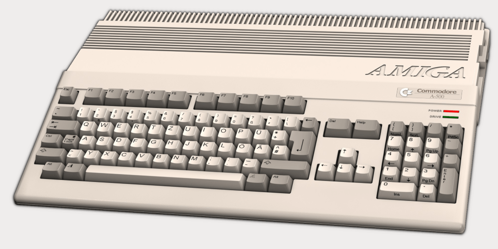

+++
title = "Raspberry Pi 400"
date = 2020-11-08

[taxonomies]
tags = ["raspberry", "pi", "Raspberry Pi 400", "kit", "rpi", "rpi400", "Amiga", "Amiga 500", "desktop", "computer", "keyboard", ]
categories = ["default"]

[extra]
has_hero = true
image_alt = "Raspberry Pi 400 was just released (11/2020)"
#long_title = "Raspberry Pi 400 — The 🍒 on top of the 🍰"
sub_title = "The <abbr title='cherry'>🍒</abbr> on top of the <abbr title='cake'>🍰</abbr>"
+++

**Raspberry Pi 400** was released, an (almost) _all-in-one_ desktop computer kit. And the new package just reminded me of my first computer, the **Amiga 500**.

<!-- more -->

On announcement day and afterwards my Twitter timeline was pretty dominated by the [announcement of the new device][r400-news], the Raspberry Pi 400. And first I felt even a bit annoyed by it, which might be more about the pandemic and isolation speaking than an actual dislike about the news. Because thinking about it a bit more I start to like the idea behind the new computer quite a lot.

My first "real" computer (besides an kids edu device when I was eight years old) was an Amiga 500, which is quite similar to the Pi 400. And I have fond memories about that time. Of course, back then and now, both have their advantages and disadvantages.

-----

## Raspberry Pi 400: Good and Bad

On the plus side: **the computer is in the keyboard;** this helps to save space at home, no place for a bulky PC case needs to be found. Similar to a laptop this is generally quite convenient. If you have a TV with HDMI at home, you don't even need to buy an extra monitor, the mouse is in the kit, so you should be able to get started pretty quickly. With the Amiga it was not that easy, but we got it with a suitable monitor anyway. Also it was much bigger than the Raspberry Pi 400, but still fit on a desk. Keep in mind, in the 90s we had to deal with huge CRT monitors which usually took quite some space on the table. Everything was still manageable.

On the other hand: **the computer is in the keyboard.** Wait what, wasn't it just an advantage a minute ago? Yes, but it can be a negative point, too. I haven't had neither a Raspberry keyboard, nor do I have access to the Pi 400 kit yet. Depending on who you ask, the keyboard is quite decent. But if you have preferences (like want to have a clickety-clackety mechanical one) you might dislike the `Pi 400` alltogether, but would maybe love the `Amiga 500` instead. Also if you love a numpad, the Pi keyboard might not be your thing, too.

A more complete and [nice review about the device][r400-review] can be seen on Jeff Gerling's YouTube channel, or if you like written form, then [his blog post][r400-teardown] might be more appealing to you. But also **E**xplaining**C**omputers [had a look at it][r400-review-ec] … as did many, many other people out there. So I won't list them all.

By the way, as mentioned in [Jeff's teardown video][r400-teardown-yt], the name »Raspberry Pi 400« seems to be a homage to the Amiga 500 (and other similar _computer in a keyboard_ devices). So my memory trigger was not by accident then. Though in the [design article][r400-design] they seem to have loved the Commodore 64 slightly more; I never had one sadly.

## Use Cases for the Pi 400

The new Pi might not be for everyone in general, besides the _computer in a keyboard_ aspect mentioned above there are probably also more reasons why to choose it or have a pass on it.

I clearly see it for two areas/groups:

* beginners in computers (and tinkering)
* schools / education

Beginners can be kids or other people not having a chance to play and use computers before. And of course, while talking about kids the class room would be also a nice fit for the **Raspberry Pi 400.**

Due to its price point around $70 this hardware it an very affordable piece for schools or low/no income households. A **complete kit** (Pi, mouse, power supply, HDMI cable/adapter, book, SD card with OS) will set you off **$100** (or roughly 97€ / £94, depending on seller), plus some monitor (which can be cheaply bought on eBay or second hand, let's say $30 to $50 for a decent one). So for under $150 you can get a full work station. If you can spend a bit more, add at least an USB hard drive to store your data in a better place than the SD card.

And also school boards should have an easier time to equip there classes with computers now with that pricing.

For tinkerers and hobbyists like me the new Pi might not be a go-to device in general. Though I could imagine to have at least one on my desk attached via KVM switch to my screen, just as a more stationary pedant to my other berries floating around in the flat: as a test bed to try things before they get deployed to the others, the compilation station, … see, there are some use cases. Yet I will probably not purchase one right now, but just have it in the back of my mind once I get bored again. Which rarely happens.

And I'm more of a blue berry guy anyway. 🤷🏻‍♂️

If you want to buy one, head over to the [product page][r400] and select your desired keyboard layout and country, then they will provide you with some distributors.

-----

Also: Will the Raspberry Pi 400 make the _»Year of the Linux Desktop«_ finally happen?

_And why don't we have a raspberry emoji yet?_

<!-- links -->

[rpi]: https://www.raspberrypi.org/
[r400]: https://www.raspberrypi.org/products/raspberry-pi-400/
[r400-news]: https://www.raspberrypi.org/blog/raspberry-pi-400-the-70-desktop-pc/
[r400-design]: https://www.raspberrypi.org/blog/designing-raspberry-pi-400/
[r400-review]: https://www.youtube.com/watch?v=3A7pQN5W08E
[r400-review-ec]: https://www.youtube.com/watch?v=P1E5xszQqV8
[r400-teardown]: https://www.jeffgeerling.com/blog/2020/raspberry-pi-400-teardown-and-review
[r400-teardown-yt]: https://www.youtube.com/watch?v=OqpylxLhw98
