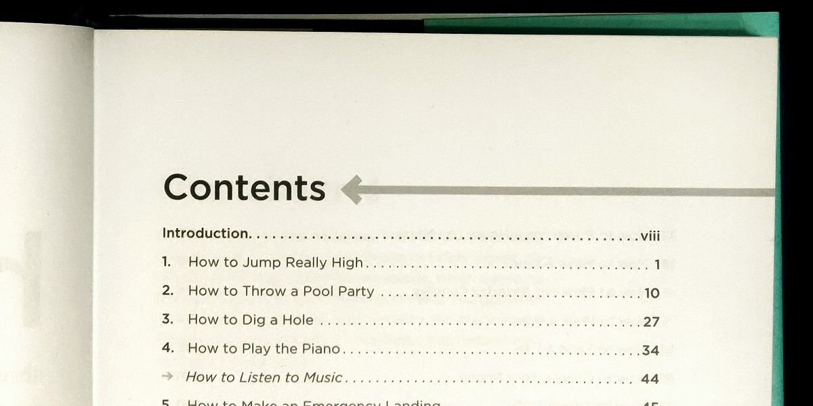

+++
title = "Responsive TOC leader lines with CSS"
date = 2021-03-15

[taxonomies]
tags = ["table of contents", "leaders", "leader line", "dotted line", "dot leaders", "responsive", "CSS", "dots",  "TOC", "index", "page", "layout", "design", "style", "letterpress", "book", "guide"]
categories = ["default"]

[extra]
# Do not forget to create a cover.png!
has_hero = true
image_alt = "Table Of Contents over a table of contents, with way too many dotted lines. #TOCeption"
custom_css = """
.small {
  font-size: 75%;
  line-height: 1.1;
}

.step1-entry {
  display: grid;
  grid-template-columns: auto max-content;
  grid-template-areas: "chapter page";

}
.step1-chapter {
  grid-area: chapter;
}
.step1-page {
  grid-area: page;
}

.final-entry {
  display: grid;
  grid-template-columns: auto max-content;
  grid-template-areas: "chapter page";
  align-items: end;
  gap: 0 .25rem;
}
.final-chapter {
  grid-area: chapter;
  position: relative;
  overflow: hidden;
}
.final-chapter::after {
  position: absolute;
  padding-left: .25ch;
  content: " . . . . . . . . . . . . . . . . . . . . . . . . . . . . . . . . . . "
  ". . . . . . . . . . . . . . . . . . . . . . . . . . . . . . . . . . . . . . . "
  ". . . . . . . . . . . . . . . . . . . . . . . . . . . . . . . . . . . . . . . ";
  text-align: right;
}
.final-page {
  grid-area: page;
}
"""

[[extra.suggestions]]
text = "More fun without JavaScript in the frontend"
link = "/posts/2020/10/wrote-javascript-to-avoid-javascript/"
[[extra.suggestions]]
text = "My love for minimalistic web design"
link = "/posts/2018/05/minimalism-focus-clean-redesign/"
+++

Not long ago I replaced my homepage of an image based overview with a very slim Table Of Contents version.
The trickiest part was to make that responsive. I finally found a solution. As usual: no JavaScript involved.

<!-- more -->

A table of contents (TOC) page is something coming from the good old book world. Here's an example:



It lists the different chapters and on which page you can find them.
For this kind of presentation there is a slight usability problem if it hadn't been designed the way it is: the chapter titles are pretty short for the given font size and therefore a lot of space between the title and the page number would occur.
Now guess how hard it would be to find the correct page for each chapter without accidentally jumping a line or two. I've had my fair share of such listings with smaller fonts and lots of items. More than once I took a ruler or pen to use it as a guide. Not a very pleasant experience.

<div class="step1-toc box small">
  <h5>Contents</h5>
  <div class="step1-entry">
    <div class="step1-chapter">A very short title</div>
    <div class="step1-page">4</div>
  </div>
  <div class="step1-entry">
    <div class="step1-chapter">Another short title</div>
    <div class="step1-page">8</div>
  </div>
  <div class="step1-entry">
    <div class="step1-chapter">Very short indeed</div>
    <div class="step1-page">15</div>
  </div>
  <div class="step1-entry">
    <div class="step1-chapter">Find the line</div>
    <div class="step1-page">16</div>
  </div>
  <div class="step1-entry">
    <div class="step1-chapter">Without leaders</div>
    <div class="step1-page">23</div>
  </div>
  <div class="step1-entry">
    <div class="step1-chapter">Tricky, right?</div>
    <div class="step1-page">42</div>
  </div>
</div>

To help the reader not getting lost publishers usually add those pretty useful dotted lines which connect the chapter title and the page number visually. Now there is no ambiguity about what belongs to what.
These dotted lines are more commonly called »leaders« or »leader lines« as they lead your eye from one end to the other. Besides dotted leaders there could be also dashes or underscores or any other symbol, but the dot seems to be the _leading_ sign for this feature.

As with a lot of letterpress practices and habits this kind of _contents_ page presentation also got adopted into the web world. Such index pages are not too common, but I have seen them over the years. At the time of writing my current homepage of this blog is also sporting a TOC overview for my articles; instead of page numbers I use the publishing date on the right side.

I have iterated over that page quite a lot recently, mainly because I have a responsive design and want that contents listing adjust appropriately.

Now the actual tricky part are very long titles which then wrap over multiple lines. This can happen either at all times or only at certain breakpoints, because font size and width would make the titles wrap.

```md
Contents
==================================================

A very short title ............................. 1
Slightly longer title which needs to break into
multiple lines to fit on the page .............. 2
Another short title again ...................... 3
```

While this might not impose a huge problem in word processors and the print world, the web is still a bit behind when it comes to fancy presentation styles.

It took many years to get flex boxes[^flex], grids[^grid], and multi-column[^mcols] layouts.[^old]

Maybe one day we get a specialized _table of contents_ layout into CSS as well …

```html
<!-- not working - just an idea how the future could look like -->
<style>
  .toc { display: toc; toc-fill: dots; }
  .chapter { toc: chapter; }
  .page { toc: page; }
</style>
<div class="toc">
  <div class="entry">
    <span class="chapter">The ultimate answer</span>
    <span class="page">42</span>
  </div>
</div>
```

But since we do not have that (yet), let's build our own contents page with a flexible layout.

_Some more or less usable results can be found in this [StackOverflow question], but I believe the following solution is the most modern and condensed version. I'm stil very grateful for all the prior work done by the responders there and elsewhere in the internet._


## Responsive Table Of Contents

Our example HTML we want to style could look like the following:

```html
<div class="toc">
  <h5>Contents</h5>
  <div class="entry">
    <div class="chapter">A chapter title</div>
    <div class="page">1</div>
  </div>
  <div class="entry">
    <div class="chapter">Another awesome chapter</div>
    <div class="page">5</div>
  </div>
  <div class="entry">
    <div class="chapter">Be more creative with your titles ;-)</div>
    <div class="page">9</div>
  </div>
</div>
```

For brevity and focus I use only `<div>`s here. On my actual homepage I used `<h2>` headings and `<time>` elements and lots of other microdata, which is not important for this example.

Right now that wouldn't look very interesting:

<div class="toc box html hresize">
  <h5>Contents</h5>
  <div class="entry">
    <div class="chapter">A chapter title</div>
    <div class="page">1</div>
  </div>
  <div class="entry">
    <div class="chapter">Another awesome chapter</div>
    <div class="page">5</div>
  </div>
  <div class="entry">
    <div class="chapter">Be more creative with your titles ;-)</div>
    <div class="page">9</div>
  </div>
</div>

Everything is just one after the other in a single column.

Now let's make that more to something like a tabular view. But instead of a table, let's use the more flexible CSS Grid system:

```css
/* each entry line will become its own tiny grid */
.entry { display: grid; }
```

And since we already know that it has a 2 column layout (chapter on the left, page number to the right), we can also prepare that:

```css
.entry {
  display: grid;
  grid-template-columns: auto max-content;
  grid-template-areas: "chapter page";
}
```

The first column should automatically take the remaining space (`auto`) which is not occupied by the page number (`max-content`).
We're also giving the areas some names for easier reference. We only have a two by one grid, therefore a single line for the areas description is needed.

We also need to tell our pieces where they should go:

```css
.chapter { grid-area: chapter; }
.page { grid-area: page; }
```

If you don't use grid area names, the code would look a bit different here:

```css
.chapter { grid-area: 1; }
.page { grid-area: 2 / 3; }
```

I find it a bit more confusing, because the numbers are not the grid cells, but the column (or row) edges between them, starting with `1` at the left (or top) outer edge.

```yaml
               ┌───────────┬────────┐
               │           │        │
starts here -> 1  chapter  2  page  3
               │           │        │
               └───────────┴────────┘
```

You can read about [all the details of this property][grid-area] on MDN.

At this point we already have some usable intermediate result:

<div class="step1-toc box html hresize">
  <h5>Contents</h5>
  <div class="step1-entry">
    <div class="step1-chapter">A chapter title</div>
    <div class="step1-page">9</div>
  </div>
  <div class="step1-entry">
    <div class="step1-chapter">Another awesome chapter</div>
    <div class="step1-page">23</div>
  </div>
  <div class="step1-entry">
    <div class="step1-chapter">A very, very long chapter title, which hopefully has to wrap around into multiple lines to show the effect</div>
    <div class="step1-page">42</div>
  </div>
</div>

But we're still missing some pieces. The _leaders_ are not there yet, and the page numbers also need to be aligned with the last line of the chapter title (if that is a multi-line text).

The alignment can be fixed with the `align-items` property. Also let's be good citizen and add a `gap` between the _chapter_ and the _page_ divs, so the dot leaders are not crashing into the numbers in the worst case. While you could also use paddings and margins, the `gap` property of the grid also does a very good job at it.

```css
.entry {
  /* ... */
  align-items: end;
  gap: 0 .25rem;
}
```

For the leaders we can use the `::after` pseudo element. This has the advantage to not only add them without extra HTML markup, but it avoids unnecessary content, which could and would be parsed and processed by machines otherwise. Not that dots are harmful, however also not really useful either.

```css
.final-chapter::after {
  content: " . . . . . . . . . . . . . . . . . . . . . . . . . . . . . . . . . . "
  ". . . . . . . . . . . . . . . . . . . . . . . . . . . . . . . . . . . . . . . "
  ". . . . . . . . . . . . . . . . . . . . . . . . . . . . . . . . . . . . . . . ";
}
```

Yet this alone would render horribly. We have way too many dots than actual space to be filled.
Why on earth so many, you might ask? Well, at least you would need to find the minimum amount of dots (and spaces) to occupy the shortest possible chapter title in your smallest font size with the biggest contents table width. Long story short, if you need more, duplicate the middle line once or twice. The above amount did serve me well so far, I would hope it would also be sufficient for you as a starter.

_In an earlier version I used some background properties with a radial gradients for the dot rendering. And before that even some embedded SVG dots. First I thought that this new way seems hacky and verbose, but in the end I used less code and markup for the job. And I'm pretty sure that a continuous string of spaces and fullstops compresses well on the wire._

How to trim the dotted line to the needed length?

To be honest this also took me a while and lots of googling and »stackoverflowing.«

The answer is to use `overflow` as well as some good portion of `position` usage.

```css
.final-chapter {
  /* ... */
  position: relative;
  overflow: hidden;
}
.final-chapter::after {
  /* ... */
  position: absolute;
}
```

* `overflow: hidden;` cuts all content overflowing the whole chapter div, this does not affect the chapter title itself, as this particular part is text which can wrap over multiple lines, but it will apply to the `::after` content though
* `position: relative` on the parent (here chapter div) is only to support the next one:
* `position: absolute` is a bit difficult to explain; its possible use is broader than what we need here, but the important piece is that it does not reserve extra space for the element, so the overflow rule kicks in

_The rule `position: absolute` usually sounds scary and in most cases works the way that it will then position the element absolute to the page. But this is actually not the full truth.
If you have an ancestor with a position of relative or absolute, then this closest container will become the reference for absolute positioning. This is a neat trick to move around a child in a parent div with the usual top/bottom and left/right properties instead of awkward padding and margin shuffling._

For the left-to-right text scenario our positioning rules can be interpreted as »oh, look there is some room until the end of the container (right side of the last line of text) , so write the ::after content there, but cut off everything which does not fit« … exactly what we need here.

```yaml
 |<--               max available width                -->|
 ┌────────────────────────────────────────────────────────┐
 │ ┌───────────────────────────────────────────────────── │
 │ │ The first line of my very very verrrry long chapter  │
 │ └───────────────────────────────────────────────────── │
 │ ──────────────────┐ ┌────────────────────────────────┐ │
 │   title overflows │ │ free space for the dot leaders │ │
 │ ──────────────────┘ └────────────────────────────────┘ │
 └────────────────────────────────────────────────────────┘
```

Now we have all the pieces for a responsive leaders layout.

Without further ado all the parts together in the …

### Final result

With some tweaks as follows:

* add some tiny padding on the left side of the leaders to avoid a dot running too close to the last word of your chapter title (1ch is the width of "0", a quarter of it is enough of space in most cases)
* right align the lines, so the dots are usually "in sync" with the other lines … at least as long as the page numbers have the same width, too (if you use a monospace font for your TOC, then this will always look nice, even without explicit text alignment)

A live example can be seen [here][page], and the code is also in [this repo][repo].

#### HTML code

```html
<div class="toc">
  <h5>Contents</h5>
  <div class="entry">
    <div class="chapter">A chapter title</div>
    <div class="page">1</div>
  </div>
  <div class="entry">
    <div class="chapter">Another awesome chapter</div>
    <div class="page">5</div>
  </div>
  <div class="entry">
    <div class="chapter">Be more creative with your titles ;-)</div>
    <div class="page">9</div>
  </div>
</div>
```

### CSS code

```css
.final-entry {
  display: grid;
  grid-template-columns: auto max-content;
  grid-template-areas: "chapter page";
  align-items: end;
  gap: 0 .25rem;
}
.final-chapter {
  grid-area: chapter;
  position: relative;
  overflow: hidden;
}
.final-chapter::after {
  position: absolute;
  padding-left: .25ch;
  content: " . . . . . . . . . . . . . . . . . . . . . . . . . . . . . . . . . . "
  ". . . . . . . . . . . . . . . . . . . . . . . . . . . . . . . . . . . . . . . "
  ". . . . . . . . . . . . . . . . . . . . . . . . . . . . . . . . . . . . . . . ";
  text-align: right;
}
.final-page {
  grid-area: page;
}
```

#### Rendered output

<div class="final-toc box html hresize">
  <h5>Contents</h5>
  <div class="final-entry">
    <div class="final-chapter">A chapter title</div>
    <div class="final-page">9</div>
  </div>
  <div class="final-entry">
    <div class="final-chapter">Another awesome chapter</div>
    <div class="final-page">23</div>
  </div>
  <div class="final-entry">
    <div class="final-chapter">A very, very long chapter title, which hopefully has to wrap around into multiple lines to show the effect</div>
    <div class="final-page">42</div>
  </div>
</div>

-----

On a related note, the Smashing Magazine has a [nice collection] of some Table of Contents of the letterpress world. Maybe you find some inspiration for alternative index page designs there if the classical TOC gets too boring.

I hope this walkthrough was useful to you.

_Have you tried it yourself? Is something not working as expected? Let me know and [send me a message] on Twitter._

Happy table of contenting! 📖

<!-- footnotes -->
[^flex]: [MDN: CSS Flexible Box Layout][flexbox]

[^grid]: [MDN: CSS Grid Layout][grid]

[^mcols]: [MDN: CSS Multi-column Layout][multi-columns]

[^old]: In fact I am so old that I do remember the time when even CSS was not a thing. `<table>`s where our main tool for layouts, `<font>` and `<center>` our design spice … let's `<marquee>` roll some text again, shall we? `</marquee>`

<!-- links -->
[flexbox]: https://developer.mozilla.org/en-US/docs/Web/CSS/CSS_Flexible_Box_Layout
[grid]: https://developer.mozilla.org/en-US/docs/Web/CSS/CSS_Grid_Layout
[multi-columns]: https://developer.mozilla.org/en-US/docs/Web/CSS/CSS_Columns
[StackOverflow question]: https://stackoverflow.com/questions/2508732/create-leading-dots-in-css
[grid-area]: https://developer.mozilla.org/en-US/docs/Web/CSS/grid-area
[repo]: https://github.com/asaaki/responsive-toc-leaders-in-css
[page]: https://asaaki.github.io/responsive-toc-leaders-in-css/
[nice collection]: https://www.smashingmagazine.com/2008/07/table-of-contents-creative-and-beautiful-examples/
[send me a message]: https://twitter.com/asaaki
