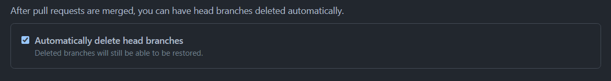

+++
title = "Clean up unmerged branches on GitHub automatically"
date = 2021-09-21

[taxonomies]
tags = ["GitHub", "git", "branch", "pull request", "PR", "delete", "clean up", "remove", "automatic", "action", "workflow"]
categories = ["default"]

[extra]
# Do not forget to create a cover.png!
has_hero = true
image_alt = "GitHub cannot natively do what GitHub Actions can do: delete branches of unmerged pull requests"

[[extra.suggestions]]
text = "How you can manage multiple GitHub accounts on a single computer"
link = "/posts/2021/02/github-with-multiple-profiles-gpg-ssh-keys/"
[[extra.suggestions]]
text = "What to do when git status is too slow when working with WSL2 on Windows 10"
link = "/posts/2020/10/faster-git-under-wsl2/"
+++

GitHub can automatically delete merged head branches of pull requests only.[^gh1]
And I have a tiny GitHub Action for you to clean up the unmerged ones.

<!-- more -->

In 2019 GitHub introduced a pretty nice feature, where you can set up your repositories to automatically delete the branch which just got merged after a pull request (PR) got accepted and closed. Which makes sense for most git workflows: your work just got into the main branch, so why would you want to keep the head branch of your feature around? Exactly. And yes, it is only a single click on a button in the interface, but you will be surprised how rarely people actually click on it.

So, please enable the setting in your repo to free people from this burden, you'll find it on the main settings page:



One problem we have at work is that in some of our repositories, there is a lot of work going on, people open PRs, most get merged, some don't, some branches and PRs propably get abandoned and forgotten … there are plently of reasons why such cruft builds up over time. And within a growing organisation this will just increase.

This issue might get amplified by adopting a GitOps approach, where also more automation like bots create and manage changes and pull requests. And most likely not all of those PRs get merged.

So while the successful PRs clean up after themselves, the unmerged branches still linger around.

And while branches are theoretically cheap (from a more technical point of view), they are not cheap for us humans. If I have a repository with usually 10 active engineers, but 30 or more open pull requests and an ever growing pile of branches of unmerged PRs and other work and experiments, this makes it harder for me to assess the health of the project. Are those 150 branches still needed? What is their state? Are they useful?

Also for folks like me who get itching or even suffer from <abbr title="Obsessive-Compulsive Disorder">OCD</abbr>, this becomes an unbearable situation.

Fear no more, I have a tiny GitHub Action for your workflows. It is really just a few lines of code as it utilizes the github-script action, so we can focus on the important bits.

The business logic is the following:

```js
const { repo, owner } = context.repo;
const pull_number = context.payload.pull_request.number;
const ref = `heads/${context.payload.pull_request.head.ref}`;
const checkParams = { owner, repo, pull_number };
const deleteParams = { owner, repo, ref };

const isMerged = await (async () => {
  try {
    await github.pulls.checkIfMerged(checkParams);
    return true;
  } catch (e) {
    if (e.status && e.status === 404) { return false; }
    // escalate all unexpected errors
    throw e;
  }
})();

if (!isMerged) {
  console.log(`Deleting branch: "${ref}"`);
  try {
    github.git.deleteRef(deleteParams);
  } catch(e) {
    console.log("Cannot delete branch; error:", e);
  }
}
```

Not a lot, right?

All it does is checking if the PR in question got merged, and if not then tries to delete the associated branch with it. I wrapped in a try-catch block, as you could have manually deleted the branch before the workflow ran, or if the git weather goddesses decided that it cannot happen for other reasons.[^fails]

You can check and copy-paste the whole workflow file from the example repository over there:
<https://github.com/asaaki/gha-delete-unmerged-branches/blob/main/.github/workflows/delete-unmerged-branch.yaml>

The repo also showcases how it looks like when the action runs:
<https://github.com/asaaki/gha-delete-unmerged-branches/pull/2>

And that's all there is to it.

Of course, you could also employ an _Engineering Janitor,_ but nobody would want to pay for that. And to be honest: I have better things to do. 😜

There are also more sophisticated GitHub Actions out there, but they do a lot more than what I need and want. Also for an organisation like at my workplace where also security is quite important we cannot use everything from the public interwebz without vetting it first. And instead of assessing a full blown external dependency the 20-something lines above will just do; at least it saves me and others a lot of time. So we can go back to building great products, while I am a [happy guy] again. 🐶

<!-- footnotes -->
[^gh1]: Announcement: <https://github.blog/changelog/2019-07-31-automatically-delete-head-branches-of-pull-requests/>

[^fails]: Since this is a clean up task and won't block you or others in any other way, there doesn't need to be done much more at this point. But feel free to file an issue if you believe the script needs to be more elaborate.

<!-- links -->
<!-- [happy guy]: https://www.youtube.com/watch?v=Y8V8iPnsKM0 -->
[happy guy]: https://www.tiktok.com/@deejaymoo41/video/6820572976413543686
