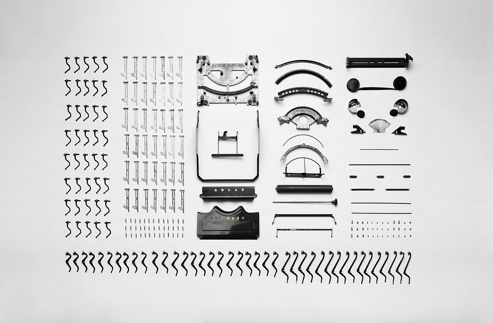

+++
title = "git's autocrlf=true considered harmful"
date = 2021-10-31

[taxonomies]
tags = ["git", "line break", "crlf", "lf", "\\n", "\\r\\n", "config", "autocrlf", "eol", "typewriter", "line feed", "carriage return", "newline"]
categories = ["default"]

[extra]
# Do not forget to create a cover.png!
has_hero = true
image_alt = "Set 'autocrlf' to 'false' and 'eol' to 'lf' and never look back again!"

[[extra.suggestions]]
text = "GitHub workflow/action to help you clean up all the unmerged branches"
link = "/posts/2021/09/delete-unmerged-branches-github"
[[extra.suggestions]]
text = "How you can manage multiple GitHub accounts on a single computer"
link = "/posts/2021/02/github-with-multiple-profiles-gpg-ssh-keys/"
[[extra.suggestions]]
text = "What to do when git status is too slow when working with WSL2 on Windows 10"
link = "/posts/2020/10/faster-git-under-wsl2/"

+++

To quote from a StackOverflow answer: »Never turn autocrlf on, it causes nothing but headaches and sorrows.«[^so] There's not much to add to that statement, so I provide some background to line breaks in general. No typewriters were harmed in the process.

<!-- more -->


If you don't have to deal with CRLF delimited files, don't bother configuring git to automatically convert between the different line break options. Set autocrlf to false (and eol to lf) and live a happy life!


`git` is probably the most famous (and perhaps also most used) version control system (VCS) in software development. I had brief periods with CVS (not to be confused with CSV files) and Subversion (SVN), wanted to try Mercurial (but never did), heard of Perforce … but the tool I used most is still git. And it probably doesn't help that I put my projects on GitHub, and if I wouldn't there, it would be Gitlab or another git based hosting platform perhaps. Well, and at work we're basically in the same position.

And while git looks pretty simple at the surface it is anything but simple, or easy for that matter. A few months ago I watched a live stream by [mgattozzi], where he walked through the [git config documentation], took some time to cover all options. I learned a lot (and of course forgot most of it again).

So if you ever think to yourself _»I have been using this tool for decades and still can't get around it«_ then don't worry, we all have been there, and continue doing so.

Matters get a bit weird if you work across different operating systems which come with their own views on the world. And one of the constant troubles are default line breaks in text files. `git` comes with some configuration options to accommodate the different needs.

## What's the fuzz about those line breaks anyway?

Everytime you hit the <kbd>⏎</kbd> key[^enter] in your editor and save the file, your computer writes down that line break.
And unsurprisingly in tech we couldn't agree on, what's the best way do store such control character(s), so we had and still have different options.

Fortunately the most common byte sequence nowadays on Linux and Unixoid systems (like macOS) is `\n`, also known as `LF` for "line feed"; `LF` is encoded as `0x0A` in hexadecimal, or `10` in decimal. It's also referred to as "newline" character.

Then there is Windows which loves its `\r\n` sequence, called `CRLF`, which is the combination of `CR` and `LF`. `CR` stands for "carriage return" and has the value `0x0D` (`13` in decimal).

A thing of the past is a single `CR`, that's what Apple used in the pre-OSX/macOS times, but not anymore.

And to be honest, I wish we could convince Microsoft to also move to LF-only as a default line break control character. The savings on file sizes globally would be huge. But the very least uncountable to the preservation of people's sanity.

## Why do these two control characters exist?

That's a pretty historical reason and comes from the typewriter times. You know, those weird direct-to-paper keyboards, sometimes very mechanical and noisy. Well, we still have very noisy mechanical keyboards, but those can be connected to computers now. Why you would want to use one of those I cannot understand … but I digress.

[](https://commons.wikimedia.org/wiki/File:Typewriter(AdlerFavorit)apart.jpg)

Typewriters. You had a keyboard to enter your text, but the letters where always hitting the same spot in the center, so the paper moves from right to left to fill a line. And same also for multiple lines, you had to move the paper up.

Fun thing is, you could do both operations, the vertical and horizontal movements, independently. Especially staying in the same line and moving back was great way to immediately correct mistakes and strike them out with a bunch of `-` characters for example.

The carriage return was the movement back to the beginning of the (same) line; the carriage being the whole bulky thing the paper was placed in and moving horizontally while you were typing.

_As an aside: How did you know that you needed to return without looking at the paper (because you're supposed to look at whatever you needed to type up instead)? There was a bell integrated which rang when you hit some right margin, accustically telling you that you needed to finish your line.[^bell]_

The line feed on the other hand is the movement of the platen, that tube/roll thingy the paper was wrapped around. Usually it was moved enough to position the paper onto the next line you wanted to type.[^steps]

Of course, even in the age of typewriters, it was pretty common to do both actions in combination, therefore the carriage return lever was at some point in time usually a two-in-one part, used for both to move the carriage and trigger the line feed.

When typewriters became electrical devices they lost the lever which got replaced by the <kbd>⏎</kbd> key — it still carries the same visual meaning. But instead of moving some machinery physically _down and left_[^upright], nowadays we only instruct our computers to position the cursor in the same fashion.

Without digging this hole deeper I simply assume, that even printers in a text mode also needed and adhere to the line breaks your computer was sending to the device. To be honest I haven't looked into the lower levels of printing for a very long time. Most of the time I print some PDFs and I don't remember in which way such documents are sent over. Also it totally doesn't matter for this post. This is just my brain meandering into a few nooks and crannies, I'm sorry.

<!-- [](https://en.wikipedia.org/wiki/File:Malling_Hansen,1867,_D%C3%A4nemark.jpg) -->
<!-- https://commons.wikimedia.org/wiki/File:Comparison_of_Full-Keyboard,_Single-Shift,_and_Double-Shift_Typerwriters_in_1911.png -->


Loooooong story short: we inherited a system of ages ago, and are kinda-sorta still stuck with it. From typewriters over terminals to keyboards we continue to use the same old stuff over and over again. To make matters just a tad more complicated for us, Windows doesn't want to play with the others and assumes everyone is totally okay with different line breaks[^unicode], basically almost all programs and tools running on this OS will write files with CRLF if not told differently.

Luckily for us most programs do understand LF delimited files as well, editors and IDEs in particular are capable of dealing with them without any issues.

And if you program and develop across operating system borders, for example building software running on machines with some Linux, you most likely always want LF no matter where you do your work.

I made the mistake to follow advise on enabling git's feature to automatically translate between LF and CRLF, but it just doesn't really make sense if you ask me. If you're like me on a Windows 10 host, use WSL2, work with Visual Studio Code, and open projects either from the host or within a WSL2 environment, you are constantly faced with the different line breaks all the time. I also display the control characters with a plugin, so I actually see the difference. And it annoys me.

My love for `CRLF` was … never there in the first place.

Let's be honest, nobody is really confused about the idea that a line feed implies a carriage return. As mentioned in the footnotes, building stairs with text is probably the most uncommon thing, so removing this exceptional use case was quite okay from my point of view.

## How do I get out of this mess?

Which brings us back to `git` and it's options.

If you don't fall into some special bucket of _»but I really must have CRLF encoded text files«,_ please never ever enable `autocrlf` in your configuration.

Beyond other pretty useful defaults everyone should have the following lines in their global git configuration file:

```pl
# $HOME/.gitconfig
[core]
  autocrlf = false
  eol = lf
```

Use `autocrlf = input` if you still have to deal with files having CRLF in it and need to preserve it for whatever reason.
Also you might want to consider using `safecrlf = warn` to be made aware of issues. But as far as I understand all of this is really only necessary if and when you have to deal with potentially mixed files (having both LF and CRLF). There might be totally valid use cases, but if possible just make a huge way around CRLF, avoid its path, forget that it exists.

You can also set the config on a per repository basis, but I would highly recommend to make it part of your global setup.

```sh
# If you don't want to touch the config file directly, run the following 2 commands;
# remove `--global` if you're in a repo and want to change the setting only for it.
git config --global core.autocrlf false
git config --global core.eol lf
```

Alternatively you could also check in a `.gitattributes` file into your repository:

```
* text=auto
```

And additionally to enforce a strict LF rule use `.editorconfig` with the following configuration as a start:

```pl
# https://editorconfig.org/

# top-most EditorConfig file
root = true

# Unix-style newlines with a newline ending every file
[*]
charset = utf-8
end_of_line = lf
insert_final_newline = true
```

Most editors support editorconfigs either natively or via a plugin/extension. Highly recommended to establish shared editing standards.

And with all that stuff you should be fine. I hope. Windows always finds a way to surprise you.

I also invite you to read the [git config documentation] for further interesting options.

Last but not least you might be also interested in how to [set up git for multiple profiles](@/posts/2021/02/github-with-multiple-profiles-gpg-ssh-keys/index.md), which also can help you to maintain platform specific configurations, if you so desire.

_Sorry for this clickbaity title by the way._ 😬[^notsorry]


<!-- footnotes -->
[^so]: Full answer: <https://stackoverflow.com/a/2361321/653173>

[^enter]: also known and labeled as <kbd>↵ Enter</kbd>, <kbd>↵ Return</kbd>, or something similar; you find more keyboard shortcut versions at [⊞](@/posts/2021/04/windows-shortcut-key-symbol/index.md).

[^bell]: Guess what, we still have a control byte for the bell (<kbd>BEL</kbd>) in our ASCII/Unicode tables. It has the byte value 7 (0x07). Some terminal emulators (the software you use to interact with your shell) support that and can make a sound. Sometimes this is used to alert the user about errors.

[^steps]: Surely you could also just feed the line without a carriage return … if you wanted to make stair steps with your text. Not sure if that very useful. What I basically mean is, that there potentially very good reasons to have both actions separate. It probably covered the 100 % of all potential use cases.

[^upright]: Yes, technically speaking everything was moving right and up, but your intention was still that you wanted to "move" your letter head even though that thing was not moving. There also have been other typewriter designs and the movements might be different there, but let's not go down yet another rabbit hole. ;-)

[^unicode]: And Unicode transformation format, but that's totally out of scope here. Windows until version 10 still loves UTF-16 very much, while having some sort of UTF-8 support, but I hear that starting with Windows 11 they embrace UTF-8 a bit more, so in maybe 10 to 20 years we can at least agree on something in the wider (tech/operating system) world.

[^notsorry]: Actually I'm not sorry at all. Was looking forward to the day I could use that in a blog post title.

<!-- links -->
[mgattozzi]: https://twitter.com/mgattozzi
[git config documentation]: https://git-scm.com/docs/git-config#_configuration_file
