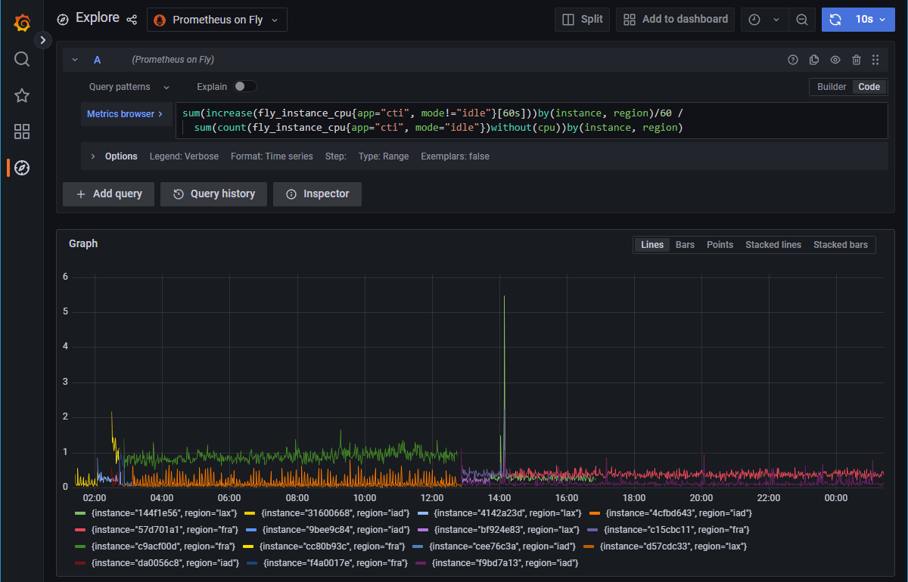
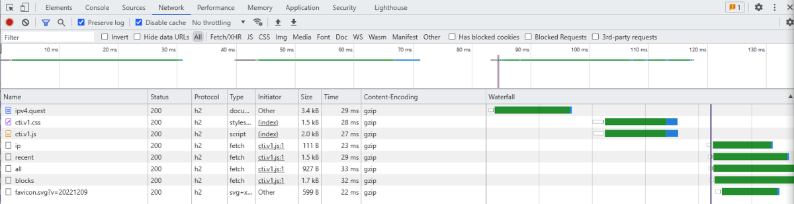

+++
title = "Capture The IP"
date = 2022-12-21

[taxonomies]
tags = ["rust", "axum", "diesel", "tokio", "hyper", "fly.io", "neon.tech", "postgres", "web service", "web app", "api", "container", "tls", "database", "ip", "ipv4", "game"]
categories = ["default"]

[extra]
has_hero = true
image_alt = "CTI — Capture The IP site at https://ipv4.quest/"
long_title = "Capture The IP — Or a tiny story about how to over-engineer a simple project for the sake of learning Rust and other things about web services and binaries"
custom_delimiter = "••• 🥏 •••"

[[extra.suggestions]]
text = "Want to use Rust via Wasm more on the edge?"
link = "/posts/2021/01/rust-wasm-on-aws-lambda-edge/"
+++

Instead of following through with Advent of Code … again, my brain thought differently: why not implement ipv4.games in Rust?

<!-- more -->

What is this game even? From the original creator:


<p>I have a simple challenge for you:
<p>Send requests to my web server from lots of different IP addresses.


This sounds super simple until you realize that your current device usually just has one IP address. I mean the public facing one, with version 4. IPv6 is a completely different beast, and we will completely ignore that. Maybe in an imaginary future we will tackle that, definitely no promises whatsoever.

-----

I've been »playing« ipv4.games for a few weeks already, but just recently I came up with the idea I could build my own version of it, in Rust, of course, because why not. And also as usual after around two weeks of Advent of Code I get both annoyed and bored by the puzzles, as they not only require decent coding skills but also extremely sophisticated mathematical understanding of some problems. I never studied math or computer sciences, and I would have to »cheat« my way through the later day challenges, as I need several pointers to what the abstract problem is and how that one can be solved. To be honest, that removes a lot of fun for me at some point.

Don't get me wrong, I love the project, I even support the creator, but the puzzles become too far removed from reality that even the nice story around it doesn't help my brain to stay motivated. It's a me problem. And that's okay. I don't have to be an expert. My main driver to participate, specifically with Rust for the last four years at least, is to hone my coding skills in that language and also learn new tricks and concepts. Sometimes even a new crate from the ecosystem, though I usually try to solve most puzzles without third party libraries if possible.

Anyway back to the original topic, because you surely didn't want to read about my side quest of puzzle solving during end of year holiday season.[^maybe]

So the puzzles didn't give me the kick and I still was in the mood for programming with Rust and the IPv4 turf war was still on the radar.

Now even the basic principles of the service are told quickly:

- provide an endpoint to record a new IP and associate with a chosen name
- serve a homepage with some dopamine inducing lists and views:
  - a list of recent IP claims to show that there is activity and contenders
  - a top list of who claimed the most
  - a more or less beautiful overview of who owns which IP blocks
- serve a user page to get a few details about individual rankings
- for all the calculations and aggregations some fancy queries to a datastore
- a cheap hoster to … well … host the service
- a nice domain to put the service under
- patience and crossed fingers that the service won't die under heavy loads

So far so good.

The stack I've chosen is the following:
- [Rust] as the programming language — duh!
- [axum] as the web framework
- [diesel] as the database interface and ORM[^orm]
- a bunch of utilities around it:
  - [deadpool] as the database connection pool
  - [diesel-async] to use diesel in a more async fashion
  - some [tower-http] layers for convenience
- honorary mentions: [tokio] and [hyper] as the foundation for axum
- [Postgres] as the particular database flavour
- [neon.tech] as the database hoster — it's a serverless offering currently in a tech preview, so it's free
- [fly.io] as the web service hoster — they also have a free allowance/tier
- a fancy domain — sadly not free, but cool: [ipv4.quest]

In the early days everything was a single crate with a single binary even. The majority of the time got sunk into figuring out the right SQL incantations for Postgres to calculate the right views for the

Coincidentally [ChatGPT] got very famous now and I gave it a try. Oh boy was that useful! Asking a chat bot to provide some queries and also explain them was so helpful, I saved so much time. I have never tried GitHub Copilot, but the internet assures me that ChatGPT is already so much better (it's also more generic[^chatgpt]).

I'm usually more sceptical when it comes to AI[^ai], and also ChatGPT is not without controversies, but as a supplementary tool for programming I believe it's quite valuable. Side note: I also do not believe that such AI (chat) bots will make our profession obsolete anytime soon.

First: someone still needs to build and program the tools to begin with, they will also require constant improvements and maintenance.

Second: there is still a vast amount of existing software out there in desparate need of our attention.

Third: they will not be able to spit out complete start up businesses or full programs. This is already a super difficult task for human beings. If you have a super great business idea you still need to encode that into a precise enough language without any ambiguity left, so a machine can stimulate its neural network and machine learned algorithms to solve for that. Maybe one day we will get there, but currently the AIs still struggle even with some simple tasks at times.

It reminds me of OCR[^ocr] and voice recognition, both technologies have been around now forever (a century at least), and yet the error rates are sometimes still too high to be used reliable for all potential use cases. I'd say every time there is a human involved in the process (as the user/actor) such systems need to be extremly sophisticated to support the eight billion beings on this planet. Good luck to make that fool proof.

Where was I again? Ah, yes, computer guided computer dabbling.

## All your database are belong to us

Long story short, I saved valuable time compared to searching the interwebz with Google and StackOverflow. I'm not an SQL pro, and my last active usage in context of MySQL is also a few years back, so I forgot even some basics, let alone dialect specific intricacies (Postgres is closer to the SQL spec though, but who knows specs by hear anyway).

I also quickly switched from [sqlx] to diesel, since the former was somehow a bit too painful for me to use. While not an ORM and in my case also not really necessary I struggled with it mostly because of some super strict macro voodoo, which I couldn't really endure for long. My preferred guide called [rust-analyzer] was yelling constantly with blocks of red underlined code and the messages were not always clear to me, why it was yelling so much. Perhaps I used it wrongly and/or inefficiently, but I then made the call to switch the tools and diesel was actually way more pleasant to use. I might have lost some super duper fancy compile time checks here and there, but granted, my use case doesn't demand too much in that area anyway.

My verdict is also: while macros can be very helpful at times, please also don't overdo it. And I see a trend that more and more crates are either refactored or alternatives created to avoid heavy macro usage if possible. I appreciate that, and so does rust analyzer, which still cannot deal with all invocation patterns.

The serverless Postgres instance provided by _neon.tech_ proved to be really straight forward, but again, I don't have special needs here, a stock database does the job for me. My Windows part needed a nudge with the openssl version, but that was not a big deal either.

After I got the foundation of the application working I did several things afterwards.

## Code organization

Instead of a single flat crate I transformed the project into a cargo workspace with several members. One future reason for that was also that the migration tool doesn't work nicely with the async setup for the main app, so splitting out some responsibilities made sense. Also it's always an interesting challenge to organize the logic into some distinct pieces. Of course I went totally over board with that and now I have crates for a few constants and types and environment variable readings.

Some separation absolutely do make sense though: the DB[^db] schema is a diesel managed thing and the business logic code doesn't need to know all the internals of that. Furthermore the assets for the frontend (HTML, CSS, and JS files).

Speaking of assets and frontend …

## Let's talk about style, baby

Like the original I also chose to deploy static HTML (aside from the tiny dynamically rendered claim page), some vanilla JavaScript, sprinkled with some colourful CSS. No React, or Vue, or Svelte, or whatever the next hot shit on the frontend web framework front is. I could have. I maybe should have, since the objective was to over-engineer the solution. But somehow I felt that I did not want to invest too much on that part. I have been burned to often with npm and webpack and rollup and grunt and gulp and parcel and even swc and JavaScript based tooling in general, I just could not do it. If I wanted to suffer I wanted to take control of where I want to suffer. So I shamelessly copy-pasted most of the code from the ipv4.games site and adapted it to my needs.

I believe it's still very efficient and I also cannot imagine that a frontent library/framework can really do a much better job at it. The fetching and rendering are already pleasantly quick (with a decent internet connection), and the point of optimization lies elsewhere anyway.

I did some unrolling and hardcoding for the IP block overview, which improves the rendering already, as the layout doesn't shift that much, only data in the boxes gets populated. I should probably do similar changes to the top and recent lists as well. On the other hand my site doesn't really need to be SEO optimized that much. A regular user should have a decent visit experience and that's okay for now.

## sync, async, await … oh wait!

Let's get back to the backend again, it's more fun. At least for me.

Furthermore let's pay our attention to the core service, which does come in two parts. The migration stuff is not super interesting here, so I'll leave it for later or never.

Since axum builds on hyper, and hyper runs in an async environment like tokio, everything is pretty asynchronuous. Whatever that means, right? What I have noticed over the last few months in [/r/rust] on reddit is that many people still use [rocket] as their framework of choice. There is nothing wrong with that, but what's interesting is that the current stable release (v0.4) is not async, but instead relies on multi-threading. Version 0.5, currently available as an RC (release candidate) will change that, but development seems a bit slow and users have been waiting for that to come to live.

Now, multi-threading can work, but unless your web services does heavy number crunching on the CPU it will mostly wait for some I/O[^] interaction like file system or network, which also includes communication with the database in most cases. The beauty of asynchronuos concurrency, especially on a single thread is that during that wait time (so until the operating system tells you that your stuff you're waiting for is ready) you can already do other things. Like serving requests for other users for example. With threads that would usually involve context switches, and without diving any deeper here, let's just remember that those context switches are more costly than staying in your current thread. Your computer will appreciate you for that. Or not, who knows.

That brings me also to a tiny nitpick with the widely used runtime tokio, which promotes in its default mode still a multi-threaded setup, unless you explicitly tell it not to. And I guess this is a trade-off decision here, but I do wonder if the majority of users will really need the multi-threaded setup at all.

Don't get me wrong, a single thread alone is not always great, even Node.js, the JavaScript runtime for backends, is actually not really single threaded either, it has thread(s) for off-loading blocking I/O for example. And in my particular case I also have adjacents threads: the deadpool library spawns threads for managing the database connections, and I also implemented a dedicated thread for background work.

The potential performance impact is that on _fly.io_ I picked the free tier machines which come with a "shared CPU", which is probably also just a slice of a real physical CPU (to be honest I don't know how their compute scheduling works internally). In an ideal scenario you would spawn only as many threads as CPU cores, so context switches per core would be low to non-existent, but that's usually a pipe dream anyway.

The other famous (async) framework [actix] lost me a few years ago, and until beginning of this year I also dabbled with [tide], but that might have lost the popularity contest due to low adoption of the alternative async runtime [async-std]. As much as I liked tide and async-std I gave into the better ecosystem and community support around tokio and hyper. [warp] would have been another option (also running on tokio/hyper), but quite frankly I always found the way of composing the routes very odd and cumbersome.

_axum_ is relatively new on its own, but thanks to the tokio, hyper, and tower ecosystem, does not start from scratch. It's a simple framework without too many frills and batteries, similar to Sinatra in Ruby or express/hapi/koa in Node.js land. A full-blown Ruby on Rails clone is not present … yet. But question is also if that's even desired. Within the last 12 years of my professional career I've seen a steady decline for the big monolithic thing toward more smaller, concise, single purpose services, where big frameworks are not necessarily shining or needed.

The router and handlers (the functions doing that endpoint work) are nothing out of the ordinary, the API design is following the origin, the payload shape slightly adjusted, some JSON here, some query paramenters there, some DB pool state over here again.

## Pragmatically Schematic

Since the endpoints don't really do a lot, but asking the database for stuff and transforming that thanks to [serde] to JSON responsses let's talk about the data model for a bit. I'm pretty sure if I twist that Postgres stuff a bit further, the endpoint wouldn't have to do anything but stream the bits and bytes as-is from end to end.

The core data model is a single table. That table holds information about who claimed which IP when. So in the worst case the maximum size of the table is the amount of all possible IP addresses: 4,294,967,294. Now not every IP is technically usable, at least not without some spoofing. And there are ranges with are reserved for special purposes, some are reserved, some serve broadcasting and multicasting needs, some blocks are in private hand, some are private by nature, … long story short, huge ranges and blocks are just not assignable easily or at all. Even then, we have seen tables which reached the maximum 2<sup>32</sub> for their ID column and people realized that we should have switched to 64 bit integers for such identifiers a long time ago, meaning, our databases are able to handle such volumes of data.

The other "tables" are actually [materialized views], a nice feature of Postgres, which are like normal views, but persisting their results once calculated. Views are saved queries which you can also filter further if needed.

I use materialized views since that is a nice trade-off query performance, caching, and compute costs. The information of those views does not need to be realtime. And the mentioned background worker thread is running in an interval to refresh the views, currently set to every 15 seconds. This approach of database side caching is pretty neat, and will scale for the time being; I don't have to think about any CDN and caching and purging strategies. Just every quarter minute some data gets updated, that's it. Besides using materialized views, that's probably even the opposite of over-engineering, since that is more a very pragmatic approach instead.

The queries as mentioned in the beginning took some time, because crunching out the right results as needed and expected where not that simple. Some of the queries use multiple CTEs (Common Table Expressions, those things with  the "with" keyword), an alternative to deeply nested sub queries. I don't really know if they are better or worse, but in cases where I used the same CTE more than once I believe they should be more efficient. I could run EXPLAINs and try to decipher the query planner results, but I was satisfied enough with the bare query timings and saved as materialized views those timings were even better, so all good in my book for now. If that thing falls over one day, no real harm will be done, it's a toy project, no revenue impact, only hurt feelings, maybe.

## From openssl to native-ssl to rustls

I already mentioned that [openssl] under Windows issue a bit, it was just a slightly outdated version which didn't supported the latest and greatest of what TLS (or for the marketingese speaking people: SSL) can offer, so the postgres client was not happy when I tried to connect securely to my neon.tech database. A bunch of [vcpkg] updates later that was no issue. But it made me think: do I actually want to rely on openssl directly? It's a tool written in C, not Rust, and while probably saw better vetting than any new alternative I wanted to somehow stick closer to Rust if that was possible.

The first step was actually switching to native-tls, which means: use the TLS stack of the platform. For Windows that is _SChannel,_ for Macos the _Security.framework,_ and only for all other platforms it would be _openssl._

A day later I then moved on to a [rustls] stack, so plain Rust, no 3rd party bindings to some non-Rusty thing. And let's be real, the rustls logo is cool. (A slight bitter pill: _ring_, the underlying crypto library is a mix of Rust, C, and assembly, so not pure under the covers; at least it doesn't come with 3rd party dependencies, which have to be present in the system somehow.)

The integration was a bit tedious but thanks to a very recent update to diesel-async I could customize the database pool setup to utilize my preferred crates. The only exception is the cti_migrate binary, which uses diesel's EmbeddedMigrations offering, which in turn is tied to diesel's stock implementation for Postgres connections. Since I don't have to migrate all day long I didn't bother to jump down that rabbit hole. That's something for future me to investigate.

## HTTP/1.1, HTTP/2, HTTP/3?

Since fly.io offers HTTP/2 I fiddled around with that setup a bit. The documentation around that is a bit scarce and the community forum was also more a scavenger hunt for snippets of details than definite answers. The probably best configuration would be to let fly's edge terminate TLS for me and pass through the bare TCP connection down to my service. But there is a twist: the client IP is not automatically handed down with that, but that's actually a very important piece of information for me, that's the whole purpose of the game even!

The extended option would be to enable something called `proxy_proto`, which means the edge talks the [PROXY protocol] as defined by _haproxy_. Now resources, let alone crates for that protocol in Rust are almost to non-existent, there is one crate which seems to understant the header format, but I think I would have to implement a lot myself, especially if I want my service to basically act as both a proxy and a backend service in one.

The only viable option would be to put a real proxy like _haproxy_ in the middle, but somehow that sounds like suboptimal to me. Usually each component in the chain of a request will add some latency. I did ran an experiment in a second fly app, and even got something working, but I have to trial it in my actual game setup and see if that even provides any benefits. For now I let the edge still just talk HTTP to the backend, all version 2 already (thanks to h2c, meaning cleartext HTTP/2, which is basically only supported outside of browsers).

What about HTTP/3? That thing is still in its infancy and needs more time to grow, I think only Cloudflare would support it, AWS CloudFront also just got support recently, the Rust ecosystem is also not there yet, as far as I know no web framework has built-in support for that new protocol, which is vastly different from the previous HTTP implementations.

## The book of libraries

Lastly I tried something entirely different: since I already had two binaries with shared logic (though I also only use one of them in production), what if I don't link the shared code statically, but instead dynamically?

If you're on a Windows machine you might have heard of those DDL files, and on a Linux machine these pesky .so files might have brought you pain, because probably something expected a different version of glibc (something something libc.so.6 not found), yeah that's all about shared libraries.

Specifically package and distribution maintainers of the Linux landscape tout them as the holy grail, since they make patching security holes for a dependent programs a breeze. Unless version mismatches makes your life miserable instead.

Yet in my case it was a simple "I control both ends of the equation" problem, which is quite easy to solve. First I reached for a crate called _libloading_, which is for example also used for dynamic linkin in the [bevy] game engine. But the weird thing about it is, that the information about a dynamic/shared depencency is not visible from the outside, meaning tools like dumpbin (Windows) or ldd (Linux) won't tell you that this binary has more dependencies that what's stated, since the loading mechanism is part of the actual program code.

The "easier" solution is to use the same dynamic linking mechanics as everything else would do: declare the external function stub, tell the linker about that library necessary for it and where to find it. Et voilà, if done right the executable now also explicitly tells the world that it requires something new from the system.

The admittely unexciting output might look like the following:

```
$ /lib/x86_64-linux-gnu/ld-linux-x86-64.so.2 --list /app/bin/cti_server
        linux-vdso.so.1 (0x00007ffd94b74000)
        libcti_core.so => /lib/libcti_core.so (0x00007fefff40b000)
        libpthread.so.0 => /lib/x86_64-linux-gnu/libpthread.so.0 (0x00007fefff3e9000)
        … snip …
```

The second line of the list (`libcti_core.so`) now officially points to a shared library which was just compiled a few minutes ago and put in place there to be found our binary. If you want to learn more about how binaries get called and executed and also find their dependencies, I highly recommend to watch Ryan's talk about [Rust Before Main].

## Performance and resource usage

Just a quick word on that part: it's fast, it's small, both in size and requirements.

In idle times the CPU utilization looks more like ground noise:



That one spike there is a deployment, where the CPU went up to roughly 5.5 %. Yes, that's not a typo, under six percent of that shared CPU.

Of course, there is a way to drive that up, I did some stress testing, so 20 to 60 % I managed to achieve myself. I also had some visitors rushing in with their tens of thousands of different IP addresses at once. The response times peaked, some requests had to wait for a few seconds, because I only have allocated 3 instances across Europe and the US, but as far as I can tell, nothing broke, not the web service nor the database, everything and everyone got served. Excellent job of Rust, fly.io, and neon.tech — thank you!

Memory-wise the service hovers around 32 MB on a 256 MB instance. Since there is no real state during any call that number stays relatively flat, no matter what you do. This is amazing.

The usual response time for a single user from Germany with a decent DSL connection should result in 25 to 50 ms per call/endpoint, sometimes a fresh/cold call might result in 200 to 300 ms for the index page in the worst case.



With some parallel calls this is done in 3 batches taking not more than 120 ms to fetch, then a bit for the processing and rendering which also shouldn' take too long. In less than a second the business is done.

The static assets are also have some cache-control headers, so repeated calls don't incure costs beyond the uncached API calls.

I wonder if AWS can even beat that, but [the last time I tested CloudFront](@/posts/2021/01/rust-wasm-on-aws-lambda-edge/index.md) there were some inherent latencies due to their infrastructure design, and that was for Lambda@Edge, where you couldn't go below 20 ms at all. I believe the performance is even worse for apps served directly from a region (like via API Gateway for example).

What I'm saying is that I could for example build a blog server application, where everything is delivered from the app (static assets compiled in), no CDN and no caching, and it would still perform equally well like my static Netlify site.

## Notes on _fly.io_

While I praised them for their great performance, there are also some pretty annoying things.

A friend of mine told me that he couldn't deploy a Django app. For me it trouble is more around deployments when you run more than a single instance. Weirdly (thanks to a tip from the community forum) if I scale down to 1 first, deploy the new version, and then scale up to 3 again, it works quite okay.

Even then sometimes their infrastructure has tiny hiccups. An instance might hang or the scheduling is heavily delayed. I wish for fly to succeed, but they have to invest in the stability and reliability of their platform. I can deal with such shenanigans, I'm a tinkerer, I have no monetary stakes in the game here, but for businesses such things are just a no-go. Generally I believe they go in the right direction, the [firecracker] based runtime environment seems to work and perform well, and I can just hope other cloud/edge infrastructure providers will keep an eye on that and adopt same or similar patterns.

-----

## What's next?

As of now I consider the project feature complete and I also learned quite a lot of different thinks across the whole stack in Rust. There are potential future excursions I could take, like the mentioned end-to-end HTTP/2 bridge, maybe exploring HTTP/3 with a different provider/hoster, CDN and caching (which I have enough of at work to be honest), fancy frontend framework, maybe a Rust/Wasm based one, twists on the IP capturing scheme, challenges maybe, a version for IPv6 (though very unlikely as this number space is too huge and requires a different approach), more physical separation of the web services and the background worker (which could be kind of a tight cron job like thing, AWS Lambda might come to mind here). If I think long enough, I might have more ideas.

I already did spent quite some time the last two weeks on it, I probably need some distance from it for a bit.

-----

If you want to dive into the codebase and check out how I did some things and sometimes even why, go over to GitHub and have fun:


**⇛ <https://github.com/asaaki/capture-the-ip>**

Feel free to open an issue with questions and suggestions, and don't shy away from opening a pull request if you know something I should improve or change.

Use it as an inspiration for your next project if you like.

🙇[^final]

<!-- footnotes -->

[^maybe]: Or did you? 🤔

[^orm]: **O**bject-**R**elational **M**apper, funny thing to translate between your objects (in Rust: structs) and the data stored in the database.

[^chatgpt]: This AI[^ai] driven chat bot is not focused on programming at all, but it turns out that the training material must have been so vast, that it does an excellent job in providing help in such particular domains.

[^ai]: Artificial intelligence, the opposite of natural intelligence I suppose, though for the latter we don't really have proof, do we?

[^ocr]: **O**ptical **C**haracter **R**ecognition, also known as text recognition

[^db]: Short for "database", but coul also be something like _digital blob_ maybe; what are databases even really? Aren't they just a fancy abstraction layer on top of the file system, with even fancier access capabilities in the shape of a query language more powerful than your common shell can provide?

[^io]: **I**nput/**O**utput, describes the communication between systems within or across computers.

[^final]: I have just written that whole article down in one go without any review so far. I want it to get out, rather sooner than later. Thus I skipped even the proof reading I usually do. If you find any mistakes (before I do), you can keep them as a souvenir. Or ping me on mastodon and complain about it: <https://mastodon.social/@asaaki>

<!-- links -->

[Rust]: https://www.rust-lang.org/ "Rust programming language"
[axum]: https://crates.io/crates/axum "axum web application framework"
[diesel]: https://diesel.rs/ "database query builder and ORM"
[deadpool]: https://crates.io/crates/deadpool "connection pool mainly for databases"
[diesel-async]: https://crates.io/crates/diesel-async "asynchronous diesel"
[tower-http]: https://crates.io/crates/tower-http "service layers for tower based applications"
[tokio]: https://tokio.rs/ "asynchronous runtime to build reliable network applications"
[hyper]: https://hyper.rs/ "fast and safe HTTP for Rust"
[Postgres]: https://www.postgresql.org/ "relational database — also known as the Eierlegende Wollmilchsau"
[neon.tech]: https://neon.tech/ "serverless Postgres"
[fly.io]: https://fly.io/ "(serverless) web application hosting platform"
[ipv4.quest]: https://ipv4.quest/ "Capture The IP (short CTI)"
[ChatGPT]: https://chat.openai.com/chat
[sqlx]: https://crates.io/crates/sqlx "Rust SQL toolkit"
[rust-analyzer]: https://rust-analyzer.github.io/
[rocket]: https://rocket.rs/
[/r/rust]: https://www.reddit.com/r/rust/
[actix]: https://actix.rs/
[tide]: https://crates.io/crates/tide
[async-std]: https://async.rs/
[warp]: https://crates.io/crates/warp "warp, the web server framework, not the terminal or whatever else shares the name"
[serde]: https://serde.rs/ "framework for serialization and deserialization of Rust data structures"
[materialized views]: https://www.postgresql.org/docs/current/rules-materializedviews.html
[vcpkg]: https://vcpkg.io/en/index.html
[openssl]: https://www.openssl.org/
[rustls]: https://crates.io/crates/rustls
[PROXY protocol]: https://www.haproxy.org/download/2.8/doc/proxy-protocol.txt
[Rust Before Main]: https://www.youtube.com/watch?v=q8irLfXwaFM
[bevy]: https://bevyengine.org/
[firecracker]: https://firecracker-microvm.github.io/
